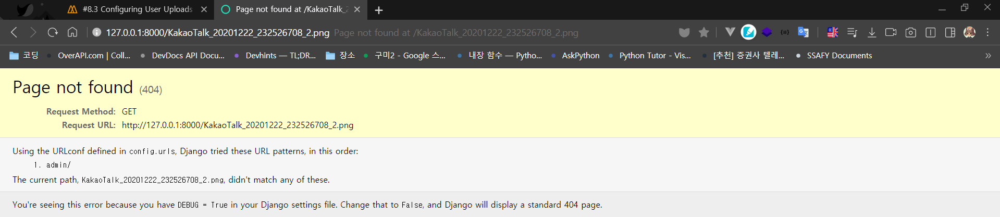

# Nomad coder - Airbnb Clone


#### 시작:

210321(일) in cafe DAMDA


#### 진행 상황

- [x] Modeling
  - [x] User App
  - [x] Room App
  - [x] Review App
  - [x] Conversation App
  - [x] Reservation App
  - [x] List App
- [x] Admin
  - [x] Customize admin page
- [x] Models & Queryset
  - [x] Queryset
  - [x] Django ORM
  - [x] Room / Item Admin (역참조)
- [x] More Admin
  - [x] Review Admin and Room Average
  - [x] Reservation
  - [x] List
  - [x] Conversation
  - [x] Room (MEDIA)
- [x] CUSTOM COMMANDS AND SEEDING (4월 23일)
  - [x] custom manage py commands & django_seed
  - [x] Amenity, Facility
  - [x] User
  - [x] Room
  - [x] Review
  - [x] List
  - [x] Reservation
- [ ] INTRODUCTION TO VIEWS AND URLS
  - [ ] 


## 환경 설정


### 0) 원격 레포지토리 설정

github에서 원격 레포지토리 생성 후

```bash
$ git init
# README.md가 추가된 상태
$ git add .
$ git commit -m "init"
# 원격 레포지토리 연결
$ git remote add origin "https://github.com/byunghun-jake/nomad-airbnb.git"

# 원격 레포 연결 확인
$ git remote
origin

# push
$ git push -u origin
```

> push 시 -u 키워드의 의미: 기본 원격 레포지토리를 origin이라는 이름의 레포지토리로 설정한다는 뜻


### 1) 가상 환경 설정

```bash
# 가상 환경 설정하기
$ python -m venv venv

# 가상 환경 활성화
$ source venv/Scripts/activate
```

- 가상 환경 설정 시, `-m`을 쓰는 이유는 뭘까? [공식 문서](https://docs.python.org/ko/3/using/cmdline.html#cmdoption-m)

  > 제공한 모듈 이름을 sys.path에서 검색하고, 그 내용을 \__main__모듈로써 실행합니다.
  >
  > `python -m module-name`
  >
  > 즉, 파이썬 모듈을 실행하기 위해 입력하는 것!

- 노마드 코더는 pipenv라는 별도의 패키지를 사용하는데, venv를 쓰는 이유는?
  - [pipenv를 추천하지 않는 이유](https://velog.io/@doondoony/pipenv-101)
  - ssafy에서 배운 내용을 그대로 활용하고 싶어서
  - 파이썬을 맞춰서 새로 설치할 필요는 없을 것 같고, 컴퓨터에 설치된 파이썬을 그대로 사용하며 패키지만 관리해주려고


- 가상환경 설정 후 .gitignore 필요

  

  > 장고 패키지까지만 설치하였는데, 수많은 파일이 생성되어 있음

  

  > gitignore로 정리 완료 후
  >
  > 참고 사이트는 항상 애용하는 [gitignore](https://www.toptal.com/developers/gitignore)

  

### 2) django 패키지 설치

```bash
$ pip install django

# 패키지 설치 목록 저장
$ pip freeze > requirements.txt
```

> 패키지 목록을 따로 만드는 이유
>
> 우리는 venv를 원격 레포지토리에 올리지 않기 때문에, 어떤 패키지들이 이 프로젝트를 위해 설치되어 있는지 확인하기가 힘들다.
> pip freeze 명령어를 통해 특정한 파일에 지금까지 설치된 패키지를 저장함으로써 이 프로젝트를 보는 다른 사람들에게 패키지 정보를 전달할 수 있는 것이다.


> requirements.txt 예시


---


## 프로젝트 시작


### 1) 장고 프로젝트 생성하기

#### 프로젝트 생성

```bash
$ django-admin startproject config .
```

```
- config
- manage.py
- README.md
```

> config 폴더와 manage.py 파일이 생성됩니다.

> 명령어에서 마지막에 `.`을 붙인 이유: 현재 폴더에 config라는 이름의 장고 프로젝트를 생성하고 싶기 때문
>
> `.`을 붙이지 않는다면, 다음과 같은 폴더 구조가 생성됩니다.
>
> ```
> - config
> 	- config
> 	- manage.py
> - README.md
> ```


- Linter & Formatter

  - Linter는 실시간 **문법 검사기**라고 생각하면 될 것 같다.

    이 프로젝트에서는 `flake8`을 사용한다.

    설정 방법은 `ctrl + shift + p`를 눌러 vs 콘솔창을 켠 후, select linter를 선택하여 flake8을 선택하면 된다.

    그러고나면, flake8이 설치되어있지 않았다라는 메세지가 뜰 텐데 flake8 패키지를 설치해주면 된다.

    `$ pip install flake8` 

    한가지 추가로 설정해 줄 것이 있는데, E501 규칙에 대한 내용이다. (라인 당 글자 길이 제한)

    ```json
    // .vscode/settings.json
    
    {
        // ...
        "python.linting.flake8Args": ["--max-line-length=100"]
    }
    ```

    

  - Formatter는 **문법 교정기**라고 생각하면 될 것 같다.

    이 프로젝트에서는 `black`을 사용한다.

    vscode의 Format On Save 옵션을 활성화해주면, 파이썬 파일을 변경하고 저장할 때 마다 `black`이 확인하고 `formatting`을 수행한다.

  

  - config 폴더에 있는 `__init__.py`의 의미

    파이썬 파일이 담겨있는 하나의 폴더를 패키지처럼 (import 할 수 있는) 사용하기 위한 일종의 표시라고 생각하면 될 것 같다.

    "이 폴더는 패키지처럼 사용할꺼야"

  

#### 시간대, 언어 설정하기

```python
# settings.py

LANGUAGE_CODE = "ko-kr"

TIME_ZONE = "Asia/Seoul"
```


#### 기본 세팅 migrate

```bash
$ python manage.py migrate
```

> 장고 프로젝트를 생성하면, 기본적으로 DB를 위한 마이그레이션 파일이 생성됩니다.
>
> 마이그레이션 파일을 가지고 DB에 적용하는 작업을 migrate라고 하며, 이를 위와 같은 명령어로 수행할 수 있습니다.


#### admin 페이지 탐색하기

1. 관리자 계정 생성

   admin 페이지에 로그인할 관리자 계정을 생성해야 합니다.

   ```bash
   $ python manage.py createsuperuser
   ```

2. 서버 실행 후 admin 페이지 주소를 통해 접근하기

   ```bash
   $ python manage.py runserver
   ```

   

### 2) 앱 생성하기

> 장고 프로젝트는 앱(함수)의 집합입니다.
>
> 여러 앱으로 구성될 수 있으며, 기능에 따라 하나가 될 수도 있고 수십개가 될 수도 있습니다.
>
> **프로젝트를 본격적으로 시작하기 전에 만들고자 하는 서비스를 분석하며, 어떤 앱이 설치되어야 하는가에 대해 생각해봅시다.**


#### 앱 구조를 짜보자

- Rooms (숙소)

  - 숙소 생성(C)
  - 숙소 확인(R)
  - 숙소 수정(U)
  - 숙소 삭제(D)

  > 어라? CRUD??

- Reservations (예약)
- User (이용자)
  - CRUD
  - 로그인, 로그아웃
- Messages (메세지)
- Lists (이용자가 저장한 숙소 목록)

- Review (리뷰)


#### 앱 생성하기

1. 앱 생성하기

   ```bash
   $ python manage.py startapp rooms
   $ python manage.py startapp users
   $ python manage.py startapp reviews
   $ python manage.py startapp conversations
   $ python manage.py startapp lists
   $ python manage.py startapp reservations
   ```

   > 생성하는 앱 이름은 복수형이어야 합니다. (국룰)

   

2. 앱 등록하기

   > 생성한 앱은 프로젝트에 "이런 앱을 생성했습니다"라고 알려주어야 합니다.

   ```python
   # config/settings.py
   
   # Application definition
   
   PROJECT_APPS = [
       "users",
       "rooms",
       "reviews",
       "reservations",
       "lists",
   ]
   
   THIRD_PARTY_APPS = []
   
   DJANGO_APPS = [
       "django.contrib.admin",
       "django.contrib.auth",
       "django.contrib.contenttypes",
       "django.contrib.sessions",
       "django.contrib.messages",
       "django.contrib.staticfiles",
   ]
   
   INSTALLED_APPS = PROJECT_APPS + THIRD_PARTY_APPS + DJANGO_APPS
   ```

   > PROJECT_APPS에 `startapp` 명령어로 추가한 앱을 담아 INSTALLED_APPS에 포함시켰습니다.
   >
   > 이렇게 앱의 출생신고를 할 수 있습니다.

   

---


## USER APP

> **SSAFY와 차이점**
>
> ssafy에서는 user model을 관리하기 위한 app의 이름을 `accounts`로 명명하였음.


- 장고에서 USER 기능을 기본적으로 제공하고 있는데, 왜 따로 설치하는 걸까요?

  > 장고에서 기본적으로 제공하고 있는 것들로는 충분하지 않고, admin 페이지에 일반 이용자가 들어가서 여러 작업을 수행하는 것은 적합하지 않습니다.
  >
  > 따라서, 별도의 App을 생성하는 것입니다.


### User Model

> Model이란?
>
> DB가 어떻게 생겼는지 설명하는 것


#### 기존 User Model을 대체하기 위한 설정

[공식문서 - Substituting a custom User Model](https://docs.djangoproject.com/en/3.1/topics/auth/customizing/#substituting-a-custom-user-model)

1. 모델 디자인

   ```python
   # users/models.py
   from django.contrib.auth.models import AbstractUser
   
   class User(AbstractUser):
       pass
   ```

   

2. 변경한 모델 등록

   ```python
   # config/settings.py
   
   # default
   # AUTH_USER_MODEL= "auth.User"
   AUTH_USER_MODEL = "users.User"			# 앱이름.모델이름
   ```

   

3. 마이그레이션

   모델에 변경사항이 생겼다면, **항상** 해줘야 합니다!

   ```bash
   $ python manage.py makemigrations
   $ python manage.py migrate
   ```


#### User Model 수정

> User model을 새로 디자인해 봅시다.
> model은 Field로 구성되어 있습니다.

```python
# AbstractUser를 상속받음
from django.contrib.auth.models import AbstractUser
from django.db import models


class User(AbstractUser):
    """ Custom User Model """

    GENDER_MALE = "M"
    GENDER_FEMALE = "F"
    GENDER_OTHER = "ETC"

    GENDER_CHOICES = (
        (GENDER_MALE, "남성"),
        (GENDER_FEMALE, "여성"),
        (GENDER_OTHER, "기타"),
    )

    LANGUAGE_ENGLISH = "en"
    LANGUAGE_KOREAN = "ko"

    LANGUAGE_CHOICES = (
        (LANGUAGE_ENGLISH, "영어"),
        (LANGUAGE_KOREAN, "한국어"),
    )

    CURRENCY_USD = "usd"
    CURRENCY_KRW = "krw"
    CURRENCY_CHOICES = ((CURRENCY_USD, "USD"), (CURRENCY_KRW, "KRW"))

    avatar = models.ImageField(blank=True)
    gender = models.CharField(choices=GENDER_CHOICES, max_length=10, blank=True)
    bio = models.TextField(blank=True)
    birthdate = models.DateField(blank=True, null=True)
    language = models.CharField(choices=LANGUAGE_CHOICES, max_length=2, blank=True)
    currency = models.CharField(choices=CURRENCY_CHOICES, max_length=3, blank=True)
    is_superhost = models.BooleanField(default=False)
```


##### Field

1. **CharField**

   max_length는 반드시 입력해주어야 합니다.

   - choices

     **지정해 놓은 특정한 값만 허용하는 속성**

     [공식문서](https://docs.djangoproject.com/en/3.1/ref/models/fields/#choices)

2. ImageField

   **이미지 파일을 다루는 필드**

   사용하기 위해서는 Pillow라는 패키지를 프로젝트에 추가해주어야 합니다.

   ```bash
   $ pip install pillow
   $ pip freeze > requirements.txt
   ```

3. CharField

   > [공식문서](https://docs.djangoproject.com/en/3.1/ref/models/fields/#choices)

   - **choices** 속성

     선택지를 정해놓고, 정해놓은 값을 입력받도록 만든다.

     ```python
     GENDER_MALE = "M"
     GENDER_FEMALE = "F"
     GENDER_OTHER = "ETC"
     
     GENDER_CHOICES = (
         (GENDER_MALE, "남성"),
         (GENDER_FEMALE, "여성"),
         (GENDER_OTHER, "기타"),
     )
     
     gender = models.CharField(
         choices=GENDER_CHOICES, max_length=10, null=True, blank=True
     )
     ```

     > `GENDER_CHOICES`를 `choices`로 넣어주는데, 내부의 튜플의 의미는 다음과 같다.
     > `(실제 DB에 기록되는 값, User에게 보여지는 값)`
     >
     > The first element in each tuple is the actual value to be set on the model, and the second element is the human-readable name.

4. 공통 필드 속성

   - **default 속성**

     모델 변경 전에 생성한 User record가 있다면, model의 변경 사항으로 인해 bio 필드가 생길 것입니다.
     하지만, User 생성 시 bio가 입력되어있지 않기 때문에 필드 추가 시 기존 record에 어떤 값을 넣어주어야 할 지 알 수 없습니다.
     default 속성을 통해 필드를 추가할 때 기본값을 설정해 주는 것이죠.

   - **null 속성** [공식문서](https://docs.djangoproject.com/en/3.1/ref/models/fields/#null)

     수정 시 새로 추가하는 필드의 null 속성이 True라면, 이전에 생성된 record를 위해 별도의 작업을 해주지 않아도 됩니다.
     **하지만, 생성할 때 빈 값을 넣어도 된다는 의미는 아닙니다. (중요)**

     

   - **blank 속성** [공식문서](https://docs.djangoproject.com/en/3.1/ref/models/fields/#blank)

     **Form**을 통해 제출 시 값이 비어있어도 되는가에 대한 설정입니다.
     null과 혼동이 될 수도 있지만, **null은 DB / blank는 form** 에서 영향력을 발휘한다고 생각하면 이해하기 쉬울 것 같습니다.

   


모델을 수정하고, admin/user 페이지로 이동하면 Operation Error가 발생합니다.


`users/models.py`에는 bio 필드가 있지만, DB에는 bio 필드가 없습니다.
`users/admin.py`에 `users/models.py`를 import하여 페이지를 구성했기 때문에 admin 페이지와 DB가 동기화되지 않은 것이죠. (admin 페이지는 변경사항 적용 & DB는 미적용)
따라서, DB에 변경 사항을 적용해주어야 합니다. 바로, **migrate**로 말이죠.


### User Admin


#### 1. ModelAdmin 상속

> 기존 User model을 대체하였기 때문에 Admin 페이지에 새로 등록을 해주어야 합니다.

```python
# users/admin.py

from django.contrib import admin
from .models import User
# 생성한 모델을 admin에 등록하는 것이기에 불러와야 함


class UserAdmin(admin.ModelAdmin):
    list_display = (
        "id",
        "username",
        "email",
        "gender",
        "language",
        "currency",
        "is_superhost",
    )

    list_filter = (
        "is_superhost",
        "language",
        "currency",
    )


admin.site.register(User, UserAdmin)
```

> 1. UserAdmin: admin/model 페이지를 커스텀하기 위해 사용
>
>    list_display: 어떤 컬럼을 목록에 표시할 지 설정
>
> 2. admin.site.register: admin 페이지에 모델을 등록하는 코드
>
>    첫 번째 인자로는 모델을 받고, 두 번째 인자로는 커스텀을 위한 클래스를 받는다.


- User model을 사용하기 위해 불러오는 방식

  ssafy에서 배울 때에는 User를 커스텀한 후, 불러올 때는 직접 불러오지 않고 `get_user_model` 함수를 이용하라고 하였습니다.
  따라서, `from .models import User` 대신 `from django.contrib.auth import get_user_model`을 사용합니다.

  ```python
  from django.contrib import admin
  from django.contrib.auth import get_user_model
  
  class UserAdmin():
      #...
  
  admin.site.register(get_user_model(), UserAdmin)
  ```

  

- Admin page에 model을 등록하는 방법

  1. 메서드

     ```python
     from django.contrib import admin
     from django.contrib.auth import get_user_model
     
     class UserAdmin(admin.ModelAdmin):
        #...
     
     admin.site.register(get_user_model(), UserAdmin)
     ```

     

  2. 데코레이터

     ```python
     from django.contrib import admin
     from django.contrib.auth import get_user_model
     
     @admin.register(get_user_model())
     class UserAdmin(admin.ModelAdmin):
        #...
     ```

     

#### 2. UserAdmin 상속

> django는 User model을 위한 admin 클래스가 이미 존재한다.
> `UserAdmin`

> 이 클래스를 상속 받아 CustomUserAdmin을 정의해보자


admin 상세페이지에서 각 필드를 그룹화하기 위해 `fieldset` 클래스 변수를 사용합니다.

```python
from django.contrib import admin
from django.contrib.auth.admin import UserAdmin
from django.contrib.auth import get_user_model

class CustomUserAdmin(UserAdmin):
    """ Custom User Admin """

    fieldsets = UserAdmin.fieldsets + (
        (
            "CustomProfile",
            {
                "fields": (
                    "avatar",
                    "gender",
                    "bio",
                    "birthdate",
                    "language",
                    "currency",
                    "is_superhost",
                ),
            },
        ),
    )
    
admin.site.register(get_user_model(), CustomUserAdmin)
```

> 기존에 정의되어 있던 fieldsets를 사용하기 위해, `UserAdmin.fieldsets`를 "+"로 붙여주었다.


---


## 모델링


### 앱 세팅

- INSTALLED_APPS에 추가하기

  > 앱을 등록하는 방식도 여러가지가 있었는지 몰랐음

  - Nico's way

    ```python
    PROJECT_APPS = [
        "users.apps.UsersConfig",
        "rooms.apps.RoomsConfig",
    ]
    ```

  - My way

    ```python
    PROJECT_APPS = [
        "users",
        "rooms",
    ]
    ```

---

### Room App

#### Model

- created_at과 updated_at이 사용되는 모델이 다양하기 때문에 **모델 상속**을 공부하는 겸 Timestamp model을 만들어보도록 하자!
  추가로 **추상 모델**에 대한 공부도 할 수 있다.

  상속을 위한 model은 core라는 별도의 앱에 작성할 예정이므로, 

  1. core app 생성

  2. core app 등록

  3. core/models.py에 TimeStampedModel 정의

     ```python
     from django.db import models
     
     
     class TimeStampedModel(models.Model):
     
         """ Time Stamped Model(created_at & updated_at) """
     
         # auto_now_add: 생성 시간을 입력
         created_at = models.DateTimeField(auto_now_add=True)
         # auto_now: save 메서드 호출 시 시간을 입력
         updated_at = models.DateTimeField(auto_now=True)
     
         class Meta:
             abstract = True
     ```

     - abstract

       If `abstract = True`, this model will be an [abstract base class](https://docs.djangoproject.com/en/3.1/topics/db/models/#abstract-base-classes).

       추상화 모델 클래스는 데이터 베이스에 영향을 주지 않는, 다른 모델 클래스를 위한 클래스입니다.

- 생각해보니 core app에서 작성한 모델을 rooms나 다른 모델에서 사용하려면, INSTALLED_APPS에서의 순서가 꼭 지켜져야 할 것 같다. 아니면, settings.py에 위치에 대한 정보를 문자열로 저장해둠으로써 가능할까?

  > User model을 사용할 때는 문제가 발생했지만, TimeStampedModel은 상속에 대한 내용이라, 문제가 없었나? 싶다.

  

  > 교수님께 질문해야지

  

- Room 모델링

  ```python
  from django.db import models
  from django.contrib.auth import get_user_model
  from django_countries.fields import CountryField
  from core.models import TimeStampedModel
  
  
  class Room(TimeStampedModel):
  
      """ Room Model definition """
  
      name = models.CharField(max_length=140)
      # 1(User):N(Room)
      host = models.ForeignKey(get_user_model(), on_delete=models.CASCADE)
      description = models.TextField()
      # 국가 정보를 위해 서드파티 라이브러리 설치
      country = CountryField()
      city = models.CharField(max_length=140)
      price = models.IntegerField()
      address = models.CharField(max_length=140)
      max_guests = models.IntegerField()
      beds = models.IntegerField()
      bedrooms = models.IntegerField()
      baths = models.IntegerField()
      check_in = models.TimeField()
      check_out = models.TimeField()
      instant_book = models.BooleanField(default=False)
  ```

  

  - User는 여러 Room을 생성할 수 있고, Room은 하나의 User를 host로 갖는다.
    이를 1:N 관계라고 하며, model을 정의할 때 ForeignKey라는 이름의 필드를 사용한다.

    - ForeignKey

      필수 위치 인자(target model)를 받고, 필수 이름 인자(on_delete)를 받는다.

      1:N 관계 중 N에 해당하는 model에 작성한다.

      `on_delete=models.CASCAD`란, 참조하는 target이 삭제되었을 때 target을 참조하고 있던 source가 삭제됨을 의미한다.

      

    

  - 국가 관련 정보를 담기 위해 서드파티 라이브러리를 사용하였다.

    

  - 생성 시간과 수정 시간이 필요하기 때문에 TimeStampedModel을 상속받았다.


- Room에 사용할 M:N 관계를 위한 모델 생성

  ```python
  class AbstractItem(TimeStampedModel):
      """ AbstractItem """
  
      name = models.CharField(max_length=80)
      description = models.TextField(blank=True)
  
      class Meta:
          abstract = True
  
      def __str__(self):
          return self.name
  
  
  class RoomType(AbstractItem):
  
      """ RoomType Model Definition """
  
      class Meta:
          verbose_name = "Room Type"
  
  
  class Amenity(AbstractItem):
  
      """ Amenity Model Definition """
  
      class Meta:
          verbose_name_plural = "Amenities"
  
  
  class Facility(AbstractItem):
  
      """ Facility Model Definition """
  
      class Meta:
          verbose_name_plural = "Facilities"
  
  
  class HouseRule(AbstractItem):
  
      """ HouseRule Model Definition """
  
      class Meta:
          verbose_name = "House Rule"
      
      
  class Room(TimeStampedModel):
      # ...
      room_type = models.ManyToManyField(RoomType)
  ```

  

  - RoomType, Amenity 등을 위한 AbstractItem 클래스를 생성

    

  - Room과 RoomType은 1:N 관계

  - Amenity, Facility, House Rule은 Room과 M:N 관계

    M:N 관계를 나타내는 것은 **ManyToManyField**이다.

    - ManyToManyField

      한 개의 필수 위치 인자(target model)를 받는다.

      

  - [get_model](https://docs.djangoproject.com/en/3.1/ref/applications/#django.apps.AppConfig.get_model)

    

  - Photo 모델을 따로 만든 것이 특이하다고 생각 (왜 방과 구별했을까? 구별 해야만 하는 것은 아닌 것 같은데?)

    > 한 방에 여러 사진을 올려야 하니까 따로 모델을 만들어 준 것 같다

    

  - RoomType, Amenity, Facility, HouseRule은 select field로 만들어도 되지만, 별개의 모델로 만들었기 때문에 개발자가 하드 코딩으로 넣는 것이 아닌 외부에서 변경이 가능해진다.


#### Admin

```python
from django.contrib import admin
from .models import Room, RoomType, Amenity, Facility, HouseRule, Photo


class ItemAdmin(admin.ModelAdmin):

    """ Item Admin Definition """

    pass


class RoomAdmin(admin.ModelAdmin):

    """ Item Admin Definition """

    pass


class PhotoAdmin(admin.ModelAdmin):

    """ Photo Admin Definition """

    pass


admin.site.register(Room, RoomAdmin)
admin.site.register(RoomType, ItemAdmin)
admin.site.register(Amenity, ItemAdmin)
admin.site.register(Facility, ItemAdmin)
admin.site.register(HouseRule, ItemAdmin)
admin.site.register(Photo, PhotoAdmin)
```


- AbstractItem 클래스를 부모로 갖는 RoomType, Amenity, Facility, HouseRule은 공통 Admin 클래스(`ItemAdmin`)로 등록한다.


---

### Review App

- 리뷰에 필요한 항목을 확인해보자
  1. 작성자
  2. 숙소
  3. 내용 (글)
  4. 시간
  5. 항목 별 평점


#### Model


- 다른 모델 클래스를 사용해야 하는 경우에는 쌍따옴표로 감싸 텍스트로 입력해 줄 수도 있다.

  ```python
  from rooms.model import Room
  
  class Review:
      room = models.ForeignKey(Room, on_delete=models.CASCADE)
      room = models.ForeignKey("rooms.Room", on_delete=models.CASCADE)
  ```

  > 두 방식 모두 동일하다.
  >
  > 단, import를 이용한 방식은 INSTALLED_APPS의 순서에 영향을 받는다.


```python
# reviews/models.py

from django.db import models
from django.conf import settings
from core.models import TimeStampedModel


class Review(TimeStampedModel):

    """ Review Model Definition """

    user = models.ForeignKey(settings.AUTH_USER_MODEL, on_delete=models.CASCADE)
    room = models.ForeignKey("rooms.Room", on_delete=models.CASCADE)
    content = models.TextField()
    # score
    accuracy = models.IntegerField()
    communication = models.IntegerField()
    cleanliness = models.IntegerField()
    location = models.IntegerField()
    check_in = models.IntegerField()
    value = models.IntegerField()
    
    def __str__(self):
        return f"{self.content} - {self.room.name}"
```

- `__str__` 메서드를 이용하여, 해당 모델의 레코드 기본 출력값을 설정


#### Admin

```python
# reviews/admin.py

from django.contrib import admin
from .models import Review


class ReviewAdmin(admin.ModelAdmin):

    """ Review Admin Definition """

    pass


admin.site.register(Review, ReviewAdmin)
```


---

### Reservation App

#### Model

**예약과정**

> 네이버와 동일하게 구성이 되어있는 듯 하다.

- 네이버는 예약 과정을 어떻게 구분하고 있을까?
  - 예약 진행 중
  - 예약 확정
  - 예약 취소

- 강의에서 예약을 구분하는 방식
  - pending
  - confirmed
  - canceled


```python
# reservations/models.py

from django.db import models
from django.contrib.auth import get_user_model
from core.models import TimeStampedModel


class Reservation(TimeStampedModel):

    """ Reservation Model Definition """

    STATUS_PENDING = "pending"
    STATUS_CONFIRMED = "confirmed"
    STATUS_CANCELED = "canceled"

    STATUS_CHOICES = (
        (STATUS_PENDING, "예약 진행 중"),
        (STATUS_CONFIRMED, "예약 확정"),
        (STATUS_CANCELED, "예약 취소"),
    )

    # 사람은 여러 예약을 만들 수 있지
    guest = models.ForeignKey(get_user_model(), on_delete=models.CASCADE)
    # 한 방을 기준으로 여러 예약이 생성될 수 있어
    room = models.ForeignKey("rooms.Room", on_delete=models.CASCADE)
    status = models.CharField(
        max_length=20, choices=STATUS_CHOICES, default=STATUS_PENDING
    )
    # 예약 날짜
    check_in = models.DateField()
    check_out = models.DateField()

    def __str__(self):
        return f"{self.room} - {self.check_in} ~ {self.check_out}"
```


- guest가 reservation과 1:1 관계가 아닌가 헷갈렸었다.

  하나의 예약 레코드를 기준으로 보면 guest와 reservation 간의 관계는 1:1이 되지만, 여기서 작성하는 모델은 레코드를 만드는 설계도에 대한 내용임을 잊지 말아야겠다.

  Reservation 이라는 예약 레코드들의 모음에서 바라보면, 한 user(guest)는 여러 예약 record를 생성할 수 있다. 하지만, 한 reservation은 여러 guest를 담는 것이 아니다.

  따라서, guest와 reservation 간의 관계는 1:N이 되는 것


#### Admin

```python
# reservations/admin.py

from django.contrib import admin
from .models import Reservation


class ReservationAdmin(admin.ModelAdmin):

    """ Reservation Admin Definition """

    pass


admin.site.register(Reservation, ReservationAdmin)
```


---

### List App

> 숙소 스크랩 기능을 관리하는 앱

#### Model

```python
# lists/models.py

from django.db import models
from django.contrib.auth import get_user_model
from core.models import TimeStampedModel


class List(TimeStampedModel):

    """ List Model Definition """

    user = models.ForeignKey(get_user_model(), on_delete=models.CASCADE)
    rooms = models.ManyToManyField("rooms.Room", blank=True)
    name = models.CharField(max_length=80)

    def __str__(self):
        return f"{self.name} by. {self.user.username}"
```


#### Admin

```python
# lists/admin.py

from django.contrib import admin
from .models import List


class ListAdmin(admin.ModelAdmin):

    """ List Admin Definition """

    pass


admin.site.register(List, ListAdmin)
```


---

### Conversation App

#### Model

```python
# conversations/models.py

from django.db import models
from django.contrib.auth import get_user_model
from core.models import TimeStampedModel


class Conversation(TimeStampedModel):

    """ Conversation Model Definition """

    # 대화에 참여하는 사람은 여러명(3명 이상)이 될 수 있다.
    participants = models.ManyToManyField(get_user_model(), blank=True)

    def __str__(self):
        return self.created_at


# 대화에서 사용되는 메세지를 만드는 클래스
class Message(TimeStampedModel):

    """ Message Model Definition """

    user = models.ForeignKey(get_user_model(), on_delete=models.CASCADE)
    content = models.CharField(max_length=100)
    conversation = models.ForeignKey("Conversation", on_delete=models.CASCADE)

    def __str__(self):
        return f"{self.user}: {self.content}"
```


- **대화 클래스와 메세지 클래스를 따로 만드는 것이 신기하다.**

  꼼꼼히 생각해보지 않았다면, 대화 클래스에 메세지를 함께 넣어버리는 상황이 될 수 있겠어요.

  

- Conversation = 대화방 / Message = 메세지

  

- 대화방에 참여하는 사람이 3명 이상이 될 수 있기 때문에, ManyToManyField를 사용


#### Admin

```python
# conversations/admin.py

from django.contrib import admin
from .models import Conversation, Message


class ConversationAdmin(admin.ModelAdmin):

    """ Conversation Admin Definition """

    pass


class MessageAdmin(admin.ModelAdmin):

    """ Message Admin Definition """

    pass


admin.site.register(Conversation, ConversationAdmin)
admin.site.register(Message, MessageAdmin)
```


## #6 ROOM ADMIN


```python
class RoomAdmin(admin.ModelAdmin):

    """ Item Admin Definition """

    list_display = (
        "name",
        "country",
        "city",
        "price",
        "max_guests",
        "beds",
        "bedrooms",
        "baths",
        "check_in",
        "check_out",
        "instant_book",
    )

    list_filter = (
        "instant_book",
        "city",
        "country",
    )

    search_fields = [
        "city",
        "name",
        "host__username",
    ]
```

- vs code 단축키

  - 블록 지정한 것들을 줄 단위로 쪼개는 단축키

    `alt + shift + i`


- `list_display` [공식문서](https://docs.djangoproject.com/en/3.1/ref/contrib/admin/#django.contrib.admin.ModelAdmin.list_display)

  목록에서 어떤 필드를 보여줄 것인지 (어떤 column을 추가할 것인지)

  `ManyToManyField`로 정의된 필드를 추가하기 위해서는 추가 작업이 필요하다.

  ```python
  # amenities 필드에서 선택된 개수를 보여주고 싶다면?
  
  class RoomAdmin(admin.modelAdmin):
      
      list_display = (
      	# ...
          count_amenities,
      )
      
      # ...
  
      def count_amenities(self, obj):
          return obj.amenities.count()
  ```

  

- `list_filter` [공식문서](https://docs.djangoproject.com/en/3.1/ref/contrib/admin/#django.contrib.admin.ModelAdmin.list_filter)

  어떤 필드를 기준으로 필터링을 할 것인지

  

- `search_fields` [공식문서](https://docs.djangoproject.com/en/3.1/ref/contrib/admin/#django.contrib.admin.ModelAdmin.search_fields)

  > Set `search_fields` to enable a search box on the admin change list page. This should be set to a list of field names that will be searched whenever somebody submits a search query in that text box.

  **검색 방식**

  - `^`: startswith
  - `=`: iexact
  - `@`: search
  - `Deafult`: icontains

  

  **외래키 검색도 가능**

  

- `filter_horizontal`

  > By default, a [`ManyToManyField`](https://docs.djangoproject.com/en/3.1/ref/models/fields/#django.db.models.ManyToManyField) is displayed in the admin site with a `<select multiple>`. However, multiple-select boxes can be difficult to use when selecting many items. Adding a [`ManyToManyField`](https://docs.djangoproject.com/en/3.1/ref/models/fields/#django.db.models.ManyToManyField) to this list will instead use a nifty unobtrusive JavaScript “filter” interface that allows searching within the options. The unselected and selected options appear in two boxes side by side. See [`filter_vertical`](https://docs.djangoproject.com/en/3.1/ref/contrib/admin/#django.contrib.admin.ModelAdmin.filter_vertical) to use a vertical interface.
  
  
  
- Ordering

  > Set `ordering` to specify how lists of objects should be ordered in the Django admin views. This should be a list or tuple in the same format as a model’s [`ordering`](https://docs.djangoproject.com/en/3.1/ref/models/options/#django.db.models.Options.ordering) parameter.
  >
  > If this isn’t provided, the Django admin will use the model’s default ordering.
  >
  > If you need to specify a dynamic order (for example depending on user or language) you can implement a [`get_ordering()`](https://docs.djangoproject.com/en/3.1/ref/contrib/admin/#django.contrib.admin.ModelAdmin.get_ordering) method.


## #7 Model And Querysets, Django ORM


#### dir & vars

- vars

  > Return the `__dict__` attribute for a module, class, instance, or any other object with a `__dict__` attribute.

  ```python
  vars([object])
  ```

- dir

  > Without arguments, return the list of names in the current local scope.
  >
  > With an argument, attempt to return a list of valid attributes for that object.

  ```python
  dir([object])
  ```

  

```python
# int를 출력해보자

>>> dir(int)
['__abs__', '__add__', '__and__', '__bool__', '__ceil__', '__class__', '__delattr__', '__dir__', '__divmod__', '__doc__', '__eq__', '__float__', '__floor__', '__floordiv__', '__format__', '__ge__', '__getattribute__', '__getnewargs__', '__gt__', '__hash__', '__index__', '__init__', '__init_subclass__', '__int__', '__invert__', '__le__', '__lshift__', '__lt__', '__mod__', '__mul__', '__ne__', '__neg__', '__new__', '__or__', '__pos__', '__pow__', '__radd__', '__rand__', '__rdivmod__', '__reduce__', '__reduce_ex__', '__repr__', '__rfloordiv__', '__rlshift__', '__rmod__', '__rmul__', '__ror__', '__round__', '__rpow__', '__rrshift__', '__rshift__', '__rsub__', '__rtruediv__', '__rxor__', '__setattr__', '__sizeof__', '__str__', '__sub__', '__subclasshook__', '__truediv__', '__trunc__', '__xor__', 'as_integer_ratio', 'bit_length', 'conjugate', 'denominator', 'from_bytes', 'imag', 'numerator', 'real', 'to_bytes']
>>> vars(int)
mappingproxy({'__repr__': <slot wrapper '__repr__' of 'int' objects>, '__hash__': <slot wrapper '__hash__' of 'int' objects>, '__getattribute__': <slot wrapper '__getattribute__' of 'int' objects>, '__lt__': <slot wrapper '__lt__' of 'int' objects>, '__le__': <slot wrapper '__le__' of 'int' objects>, '__eq__': <slot wrapper '__eq__' of 'int' objects>, '__ne__': <slot wrapper '__ne__' of 'int' objects>, '__gt__': <slot wrapper '__gt__' of 'int' objects>, '__ge__': <slot wrapper '__ge__' of 'int' objects>, '__add__': <slot wrapper '__add__' of 'int' objects>, '__radd__': <slot wrapper '__radd__' of 'int' objects>, '__sub__': <slot wrapper '__sub__' of 'int' objects>, '__rsub__': <slot wrapper '__rsub__' of 'int' objects>, ...
```


### QuerySets

> https://docs.djangoproject.com/en/3.1/ref/models/querysets/


```python
>>> users = get_user_model()

# 1. 모든 유저 정보를 찾고 싶을 때,
>>> users.objects.all()

# 2. 특정한 조건을 만족하는 유저 정보를 찾고 싶을 때,
>>> users.objects.filter(username="admin")
>>> users.objects.filter(superhost=True)
# field lookups
>>> users.objects.filter(birthdate__gte="2021-04-01")
```


- 모델간 연결되었을 때, 매니저 호출명

  `[모델명_set]`

```python
>>> user = get_user_model().objects.get(username="admin")

# 1. 내가 생성한 방 목록을 찾고 싶을 때,
>>> user.room_set.all()

# 2. 내가 작성한 리뷰를 찾고 싶을 때,
>>> user.review_set.all()

# 3. 내가 생성한 리스트를 찾고 싶을 때,
>>> user.list_set.all()
```

> 관계 필드에 의해 모델 간의 관계가 연결되었다면, 해당하는 매니저를 통해 접근이 가능합니다.


#### 다른 모델 객체를 참조하는 매니저의 호출명을 변경하려면?

> 필드 생성 시 인자로 전달하는 옵션 중 하나인 `related_name`을 사용한다.

```python
class Room(models.Model):
    host = models.ForeignKey(settings.AUTH_USER_MODEL, related_name="myrooms", on_delete="models.CASCADE")
    # ...
```

```python
>>> user = get_user_model().objects.get(pk=1)
>>> room = Room.objects.get(pk=1)
>>> amenity = Amenity.objects.get(pk=1)

# 1. 내가 생성한 방 목록을 찾고 싶을 때,
>>> user.room_set.all()			# Error

>>> user.myrooms.all()			# Correct

# 2. 이 방을 생성한 사람의 이름을 알고 싶을 때,
>>> room.host.username			# 필드로 선언하였으니, _set과 같은 매니저를 통해 접근하는 것이 아니다.

# 3. amenity가 있는 모든 방 목록을 찾고 싶을 때, (Room - Amenity는 ManyToMany 관계이다)
>>> amenity.room_set.all()		# ManyToMany도 ForeignKey와 동일하다
```


### 역참조를 이용해 Admin 페이지 수정

#### Room Admin

> 업로드 한 사진의 개수를 보여주기

```python
# rooms/admin.py

class RoomAdmin(admin.ModelAdmin):
    # ...
    list_display = (
    	# ...
        "count_photos",
    )
    
    # Photo(N) : Room(1)
    # 역참조
    def count_photos(self, obj):
        return obj.photo_set.count()
```


#### Item Admin

> Amenity, Facility 등과 같은 Item들이 사용된 방의 개수를 보여주기

```python
# rooms/admin.py

class ItemAdmin(admin.ModelAdmin):
    list_display = (
    	"name",
        "used_by",
    )
    
    # Item(N) : Room(1)
    def used_by(self, obj):
        return obj.room_set.count()
```


---


## #8


### Review Admin


- Admin 페이지에서 평균 점수를 보여주고 싶다.

  하지만, 평균 점수는 Admin 페이지에서만 쓰는 게 아니라 실제 페이지에 데이터로도 쓸 수 있을 것 같다.

  따라서, `reviews/admin.py`에 작성하지 않고 `reviews/models.py`에 작성한다.

  ```python
  def mean_score(self):
          score = (
              sum(
                  [
                      self.accuracy,
                      self.communication,
                      self.cleanliness,
                      self.location,
                      self.check_in,
                      self.value,
                  ]
              )
              / 6
          )
  
          return f"{score:.2f}"
  ```

  > f-string 에서 소수점 표현하는 방식 기억하기
  >
  > `f"{value:.3f}"` : 소수점 셋째 자리까지 표현


### Reservation Admin

1. 현재 시간과 check_in / check_out 시간을 비교하여, 방에 대한 예약이 진행중인지 확인하는 `is_in_progress`를 만들자

   - python 라이브러리를 사용하지 않고, Django의 모듈을 사용하였다.

     ```python
     import datetime							# 파이썬 라이브러리
     from django.utils import timezone		# 장고 모듈
     ```

     > 장고 settings.py 에서 봤던 것 처럼, 장고는 서버의 시간대(TIME_ZONE)를 따로 관리하고 있기 때문

   - date와 datetime은 비교할 수 없다.

     ```bash
     >>> timezone.now() < reservation.check_in
     Traceback (most recent call last):
     File "<console>", line 1, in <module>
     TypeError: can't compare datetime.datetime to datetime.date
     ```

     동등히 비교

     ```python
     >>> timezone.now().date() > reservation.check_in
     >>> True
     ```

   - `boolean` 속성을 주어, 아이콘으로 볼 수 있도록 해보자

     ```python
     # models.py
     
     is_in_progress.boolean = True
     ```

   

2. 예약이 만료되었는지 확인할 수 있는 `is_finished`를 만들자

   ```python
   # models.py
   
   def is_finished(self):
       today = timezone.now().date()
       return self.check_out < today
   
   is_finished.boolean = True
   ```

   

3. model에서 만든 `is_in_progress`와 `is_finished`를 Admin 페이지에 사용해보자

   `list_display`에 추가하는 것은 가능했지만, **`list_filter`에 추가하니 오류가 발생했다.**

   ```python
   ERRORS:
   <class 'reservations.admin.ReservationAdmin'>: (admin.E116) The value of 'list_filter[1]' refers to 'is_in_progress', which does not refer to a Field.
   <class 'reservations.admin.ReservationAdmin'>: (admin.E116) The value of 'list_filter[2]' refers to 'is_finished', which does not refer to a Field.
   ```

   

   

### List Admin


1. 리스트 안에 몇 개의 방을 저장해두었는지 알 수 있도록 하자

   ```python
   # lists/models.py
   
   def count_rooms(self):
       return self.rooms.count()
   
   count_rooms.short_description = "Number of rooms"
   ```


### Conversation Admin


1. Message의 `list_display` 수정

2. Conversation의 `list_display`, `filter_horizontal` 수정

3. Conversation의 `__str__` 수정 (참여한 이용자들의 username이 출력되도록)

   참여한 이용자들의 수를 반환하는 `count_participants` 메서드를 정의

   ```python
   # conversations/models.py
   
   class Conversation(TimeStampedModel):
   
       """ Conversation Model Definition """
   
       # 대화에 참여하는 사람은 여러명(3명 이상)이 될 수 있다.
       participants = models.ManyToManyField(get_user_model(), blank=True)
   
       def __str__(self):
           username_list = []
           participants = self.participants.all()
           for participant in participants:
               username_list.append(participant.username)
           return ", ".join(username_list)
   
       def count_participants(self):
           return self.participants.count()
   ```

   - `join`

     `"접합자".join(붙일 이터러블 요소)`

     

### Photo(Media) [중요!]

#### 설정 전

> 아직 Photo를 위해 어떠한 설정도 해주지 않은 상태
>
> 지금 photo를 업로드하면, 프로젝트의 루트 폴더에 파일이 업로드 된다.


업로드한 이미지를 확인할 수는 있을까?



> 경로를 찾을 수 없다고 한다.
>
> 아직 우리는 경로설정을 해주지 않았다. 따라서, 이미지를 보여달라고 다음 주소(`/KakaoTalk_20201222_232526708_2.png`)로 요청이 들어오더라도 Django는 지정된 동작이 없기 때문에 아무 일도 하지 않는다.
>
> 이 결과 페이지를 찾을 수 없다는 에러가 발생하게 되는 것.


#### 설정 하기

> 크게 두 과정을 거칩니다.
>
> 1. 업로드 하는 파일의 위치 지정
> 2. 파일 요청 시 응답할 행동 설정

##### 1. Upload하는 파일의 위치 지정 (MEDIA_ROOT & upload_to)

> MEDIA_ROOT
>
> 업로드하는 파일의 루트 디렉토리를 지정해주는 변수이다.

```python
# config/settings.py

# Django 3.1 이전 방식
MEDIA_ROOT = os.path.join(BASE_DIR, "uploads")

# Django 3.1 이후 방식
MEDIA_ROOT = BASE_DIR / "uploads"
```


파일을 업로드 했을 때, 파일의 위치

`BASE_DIR / "uploads"`


하지만, 이미지는 아직 확인할 수 없다.


> upload_to
>
> FileField의 인자 중 하나로 MEDIA_ROOT를 기준으로 어느 디렉토리에 저장할 지 지정할 수 있다.
>
> **이 필드에 대응되는 파일에 대한 세부 설정**

```python
# users/models.py

class User(AbstractUser):
	# ...
    avatar = models.ImageField(blank=True, upload_to="avatars")		# BASE_DIR / "uploads" / "avatars" 에 저장
```

```python
# rooms/models.py

class Photo(TimeStampedModel):
    # ...
    file = models.ImageField(upload_to="room_photos")				# BASE_DIR / "uploads" / "room_photos" 에 저장
```

필드를 변경해주었기 때문에 migration을 진행합니다.

```bash
$ python manage.py makemigraions
$ python manage.py migrate
```


하지만, 아직 이미지를 확인할 수는 없다!


##### 2. url 설정

> 1. MEDIA_URL
> 2. urls.py


MEDIA_URL은 MEDIA_ROOT에서 제공되는 미디어(파일)을 처리하는 URL이다.

```python
# config/settings.py

MEDIA_URL = "/media/"
# 파일에 대한 요청의 루트 주소는 media이다.
# 뒤에 파일 경로가 이어지므로 슬래시(/)로 끝나야한다.
```


MEDIA_URL을 정의한 뒤 파일 요청 경로가 변경된 것을 확인할 수 있다.

변경 전: `http://127.0.0.1:8000/uploads/avatars/20200119_122532-removebg-preview.png`

변경 후: `http://127.0.0.1:8000/media/avatars/20200119_122532-removebg-preview.png`


파일 요청 경로에 맞춰 적절한 파일을 리턴해줘야 한다. 즉, 요청한 경로에 맞는 동작을 하도록 설정해주어야 한다.

```python
from django.contrib import admin
from django.urls import path
from django.conf import settings
from django.conf.urls.static import static

urlpatterns = [
    path("admin/", admin.site.urls),
]

# 로컬에서 실행할 때에만 작동하도록 하고 싶다면?
if settings.DEBUG:
    urlpatterns += static(settings.MEDIA_URL, document_root=settings.MEDIA_ROOT)
# settings 파일의 MEDIA_URL로 지정해 둔 경로를 통해 요청이 들어오는 경우
# 확인해야 할 디렉토리의 루트는 settings 파일의 MEDIA_ROOT 이다.
```


모든 작업이 끝난 뒤, 사진을 확인해보니 제대로 나오는 것을 확인할 수 있었다.

MEDIA 파일을 다루기 위한 순서를 다시 정리해보자

1. 업로드 한 MEDIA 파일이 위치할 루트 디렉토리 설정 (기본값은 BASE_DIR)

   settings의 MEDIA_ROOT

   `MEDIA_ROOT = BASE_DIR / "uploads"`

2. 각 필드 별로 세부 디렉토리 설정

   `upload_to`

3. 미디어 파일 요청 경로 설정

   `MEDIA_URL`

4. 요청 응답을 위한 동작 설정

   `static(settings.MEDIA_URL, document_root=settings.MEDIA_ROOT)`


---

- photo admin 설정

  - 커스텀한 admin 클래스에서 메서드를 선언할 때, 필수로 받는 인자인 self, obj
    photo에서 이 두개를 받아 출력하면 다음과 같은 내용이 나온다.

    ```python
    def get_thumbnail(self, obj):
        print(obj)				# __str__
        print(obj.file)			# room_photos/수와_표현_4.jpg
        print(type(obj.file))	# <class 'django.db.models.fields.files.ImageFieldFile'>
        return ""
    ```

    `obj`를 출력하면 `__str__`이 출력되고, `obj.file`을 출력하면 그 파일의 이름만 출력된다.

    `obj.file`은 문자열인 것 같지만, **클래스**이다.

    

    `dir(obj.file)`을 출력하여, 어떤 것들을 사용할 수 있는지 확인해보자

    ```python
    [..., 'chunks', 'close', 'closed', 'delete', 'encoding', 'field', 'file', 'fileno', 'flush', 'height', 'instance', 'isatty', 'multiple_chunks', 'name', 'newlines', 'open', 'path', 'read', 'readable', 'readinto', 'readline', 'readlines', 'save', 'seek', 'seekable', 'size', 'storage', 'tell', 'truncate', 'url', 'width', 'writable', 'write', 'writelines']
    ```

    

  - path와 url

    path는 파일의 절대경로를 나타낸다.
    `D:\Code\Study\nomad-airbnb\uploads\room_photos\수와_표현_4.jpg`

    url은 파일의 상대경로를 나타내며, MEDIA_URL의 값에 의해 루트 주소가 결정된다.
    `/media/room_photos/%EC%88%98%EC%99%80_%ED%91%9C%ED%98%84_4.jpg`

    

  - list_display에 thumbnail을 넣기

    - mark_safe

      사이트에 태그를 삽입하는 것은 대부분 보안에 의해 막혀있는 경우가 많다.
      DJango 역시 예외는 아니었다.
      thumbnail을 위해 `img tag`를 삽입하려면, 이 태그는 안전하다(safe)는 표시(mark)가 필요하고, django에서는 `mark_safe`를 이용하면 된다.

    ```python
    from django.utils.safestring import mark_safe
    
    def get_thumbnail(self, obj):
        return mark_safe(f"")
    ```

    

- Room Admin 설정

  - Host를 select 방식으로 선택하는 것에서 검색을 통해 선택할 수 있도록 변경하기

    - **raw_id_fields** [링크](https://docs.djangoproject.com/en/3.2/ref/contrib/admin/#django.contrib.admin.ModelAdmin.raw_id_fields)

      > By default, Django’s admin uses a select-box interface (<select>) for fields that are `ForeignKey`. Sometimes you don’t want to incur the overhead of having to select all the related instances to display in the drop-down.
      >
      > `raw_id_fields` is a list of fields you would like to change into an `Input` widget for either a `ForeignKey` or `ManyToManyField`:

    

  - 이 방과 연결된 사진을 한 번에 확인할 수 있도록 하기

    - **InlineModelAdmin** [링크](https://docs.djangoproject.com/en/3.2/ref/contrib/admin/#django.contrib.admin.InlineModelAdmin)

      > The admin interface has the ability to edit models on the same page as a parent model. These are called inlines. Suppose you have these two models:
      >
      > - TabularInline
      > - StackedInline

  ```python
  class PhotoInline(admin.TabularInline):
      model = Photo
  
  class RoomAdmin(admin.ModelAdmin):
      raw_id_fields = ("host",)
      inlines = (PhotoInline,)
  ```

  

- User Admin 설정

  - 이용자 페이지에서 숙소 관리를 할 수 있도록 하기
    - InlineModelAdmin

  ```python
  class RoomInline(admin.StactedInline):
      model = Room
  
  class CustomUserAdmin(UserAdmin):
      inlines = (RoomInline,)
  ```

  

- Class와 상속

  ```python
  class Dog:
      def __init__(self):
          print("왈왈!")
  	def pee(self):
          print("나 오줌 쌀거야!!")
  
  pug = Dog()				# 왈왈!
  
  class Puppy(Dog):		# 상속
      def pee(self):
          print("공원으로 가자!")
          super().pee()	# 부모 클래스의 pee() 메서드를 실행
  
  puppy1 = Puppy()		# 왈왈!
  puppy1.pee()			# 공원으로 가자!
  						# 나 오줌 쌀거야!
  ```

  

- Room 생성 및 업데이트 시, 도시 이름을 대문자로 만들어보자

  > 두 방법 모두 사용 가능하지만, NICO를 따라 Model을 커스텀하는 것으로 함

  - Overriding predefined model methods [링크](https://docs.djangoproject.com/en/3.2/topics/db/models/#overriding-predefined-model-methods)

    > Model에서 save 메서드를 커스텀하는 방법

    ```python
    def save(self, *args, **kwargs):
        self.city = self.city.title()
        super().save(*args, **kwargs)
    ```

    

  - save_model [[링크]](https://docs.djangoproject.com/en/3.2/ref/contrib/admin/#django.contrib.admin.ModelAdmin.save_model)

    > Admin에서 save 메서드를 커스텀하는 방법 (Admin에서만 적용)

    ```python
    def save_model(self, request, obj, form, change):
        obj.city = obj.city.title()
        return super().save_model(request, obj, form, change)
    ```

    

  - `str.capitalize()` vs `문자.title()`

    capitalize는 전체 문자에서 첫 번째 문자만 대문자로 변환하고,

    title은 공백 이후에 등장하는 첫 번째 문자들을 대문자로 변환한다.


---


## #9 Custom commands and Seeding


더미 데이터 만들기

1. 원하는 동작을 수행하기 위해 커스텀 커맨드를 만든다. 
2. 


### Writing Custom Commands

> [[참고]](https://docs.djangoproject.com/en/3.2/howto/custom-management-commands/#module-django.core.management)

1. Command에 의해 실행될 파일을 생성합니다.

   ```
   rooms/
   	__init__.py
   	management/
   		__init__.py
   		commands/
   			__init__.py
   			loveyou.py
   ```

   ```python
   from django.core.management.base import BaseCommand
   
   
   class Command(BaseCommand):
       help = "This command tells me that I love you"
   
       def add_arguments(self, parser):
           parser.add_argument(
               "--times", help="How many times do you want me to tell you that I love you?"
           )
   
       def handle(self, *args, **options):
           times = options.get("times")
           for _ in range(int(times)):
               print("I love you")
   ```

2. 파일을 실행합니다.

   ```bash
   $ python manage.py loveyou  --times 50
   I love you
   I love you
   I love you
   ...
   ```

   

---

### Seed_amenities

> Amenity를 추가하기 위한 코드

```python
from django.core.management.base import BaseCommand
from rooms.models import Amenity


class Command(BaseCommand):
    help = "어메니티를 생성하기 위한 코드"

    def handle(self, *args, **kwargs):
        amenities = [
            "Air conditioning",
            # ...
            "TV",
        ]
        for amenity in amenities:
            try:
                Amenity.objects.get(name=amenity)
            except:
                Amenity.objects.create(name=amenity)
        self.stdout.write(self.style.SUCCESS("어메니티 생성이 완료되었습니다!"))

```


### Seed_Facilities

> Facility를 추가하기 위한 코드

```python
from django.core.management.base import BaseCommand
from rooms.models import Facility


class Command(BaseCommand):
    help = "시설을 생성하기 위한 코드"

    def handle(self, *args, **kwargs):
        facilities = [
            "Private entrance",
            # ...
            "Gym",
        ]
        count = 0
        for facility in facilities:
            try:
                Facility.objects.get(name=facility)
            except:
                Facility.objects.create(name=facility)
                count += 1
        else:
            print(f"{count}개의 시설을 추가하였습니다.")

```


---


## Django seed


장고 시드 설치

```bash
$ pip install django-seed
$ pip freeze > requirements.txt
```

앱 등록

```python
INSTALLED_APPS = (
	"django_seed",
)
```


### Seed User

> 유저를 먼저 생성해보자

```python
# users/management/commands/seed_users.py

from django.core.management.base import BaseCommand
from django.contrib.auth import get_user_model
from django_seed import Seed


class Command(BaseCommand):
    help = "가짜 이용자를 만들기 위한 커맨드"

    def add_arguments(self, parser):
        parser.add_argument(
            "--number",
            default=1,
            type=int,
            help="몇 명의 유저를 생성하시겠습니까?",
        )

    def handle(self, *args, **options):
        number = options.get("number")
        seeder = Seed.seeder()
        
        # 세번째 인자로 특별히 다룰 컬럼에 대한 설정을 해줍니다.
        seeder.add_entity(
            get_user_model(),
            number,
            {
                "is_staff": False,
                "is_superuser": False,
            },
        )
        # 생성한 seeder를 실행합니다.
        seeder.execute()
        print(f"{number}명의 유저를 추가하였습니다.")
```


### Seed Room

> 방을 생성하는 seed를 만들어봅시다.

- `add_arguments()` 메서드

  명령어에 옵션을 추가하기 위해 사용합니다.

- seeder를 이용하는 방법

  1. `seeder` 인스턴스를 생성합니다.
  2. `seeder.add_entity()` 메서드
     seeder를 이용해 생성하고자 하는 객체를 지정합니다.
     - 첫 번째 인자로 어떤 모델에 대응하는 객체인지 지정합니다.
     - 두 번째 인자로 몇 개의 객체를 생성할 지 지정합니다.
     - 세 번째 인자로 직접 커스텀하고 싶은 컬럼이 있다면, 해당 내용을 지정합니다.
  3. `seeder.execute()` 메서드
     seeder를 실행합니다.

- `lambda`

  람다 표현식으로 익명 함수를 생성할 수 있습니다.

  ```python
  list(map(lambda x: x + 10, [1, 2, 3]))
  # [11, 12, 13]
  ```

- 방의 사진을 생성하는 방법

  ```python
  from django.contrib.admin.utils import flatten
  from room.models import Room, Photo
  
  # 생성한 방 객체를 변수에 저장
  # (seeder에 의해 만들어진 객체는 리턴값이 방 객체 그 자체가 아닌 듯 하다)
  new_rooms = seeder.execute()
  # 객체에서 pk값을 추출
  for room_pk in flatten(new_room.values()):
      # pk값을 이용해 만들어진 방 객체를 가져옴
      room = Room.objects.get(pk=room_pk)
      # 사진 생성
      for i in range(3, 5):
          Photo.objects.create(
              caption=seeder.faker.sentence(),
              file=f"/room_photos/{random.randint(1, 31)}",
              room=room
          )
  ```

  

- ManyToMany 관계를 갖는 필드에 객체를 추가로 연결하려고 할 때

  ```python
  # amenity 추가
  for amenity in amenities:
      if random.randint(0, 1):
          room.amenities.add(amenity)
          
  # facility 추가
  for facility in facilities:
  	if random.randint(0, 1):
  		room.facilities.add(facility)
  # house_rule 추가
  for house_rule in house_rules:
  	if random.randint(0, 1):
  		room.house_rules.add(house_rule)
  ```

  

```python
import random
from django.contrib.admin.utils import flatten
from django.core.management.base import BaseCommand
from django.contrib.auth import get_user_model
from django_seed import Seed
from rooms.models import Room, RoomType, Amenity, Facility, HouseRule, Photo


class Command(BaseCommand):
    help = "가짜 방을 생성하기 위한 커맨드"

    def add_arguments(self, parser):
        # 첫 번째 인자: 어떤 문자를 argument 신호로 줄 지
        parser.add_argument("--number", default=1, type=int, help="얼마나 많은 방을 생성할까요?")

    def handle(self, *args, **options):
        number = options.get("number")
        # Room의 Foreign Key를 위해 연결된 모델을 불러옵니다.
        users = get_user_model().objects.all()[:25]
        room_types = RoomType.objects.all()
        amenities = Amenity.objects.all()
        facilities = Facility.objects.all()
        house_rules = HouseRule.objects.all()

        # seeder 인스턴스를 생성합니다.
        seeder = Seed.seeder()
        # seeder에 어떤 걸 생성하고 싶은지 추가합니다.
        # entity: 실체, 객체
        # 첫 번째 인자로 어떤 모델에 대한 객체인지 알려줍니다.
        # 두 번째 인자로 몇 개의 객체를 생성할지 알려줍니다.
        # 세 번째 인자로 모델의 컬럼을 직접 커스텀하고 싶은 내용을 전달합니다.
        # key(컬럼) - value(들어갈 값)
        # 모델끼리 연결된 경우(ForeignKey) 세 번째 인자로 지정해주어야 합니다.
        seeder.add_entity(
            Room,
            number,
            {
                "name": lambda x: seeder.faker.company(),
                "host": lambda x: random.choice(users),
                "room_type": lambda x: random.choice(room_types),
                "price": lambda x: random.randint(100, 2000),
                "beds": lambda x: random.randint(0, 10),
                "bedrooms": lambda x: random.randint(0, 5),
                "baths": lambda x: random.randint(1, 6),
                "max_guests": lambda x: random.randint(1, 20),
            },
        )

        # seeder를 실행합니다.
        # 생성한 room 객체를 변수에 담습니다.
        # 여러 방을 생성한 경우 방 목록이 담깁니다.
        new_room = seeder.execute()
        # print(room)
        # print(flatten(new_room.values()))
        for room_pk in flatten(new_room.values()):
            room = Room.objects.get(pk=room_pk)
            # room의 사진 추가
            for _ in range(3, random.randint(5, 10)):
                Photo.objects.create(
                    caption=seeder.faker.sentence(),
                    file=f"/room_photos/{random.randint(1, 31)}.webp",
                    room=room,
                )
            # amenity 추가
            for amenity in amenities:
                if random.randint(0, 1):
                    room.amenities.add(amenity)
            # facility 추가
            for facility in facilities:
                if random.randint(0, 1):
                    room.facilities.add(facility)
            # house_rule 추가
            for house_rule in house_rules:
                if random.randint(0, 1):
                    room.house_rules.add(house_rule)

        print(f"{number}개의 방을 생성했습니다.")
```


### Seed Review

> 방에 대한 리뷰를 만들어봅시다.


- 점수에 제한을 주기 위해 `random.randint()`를 사용하였습니다.
- user와 room은 ForeignKey로 연결되어 있기에 `random.choice()`를 사용하였습니다.


```python
import random
from django.contrib.auth import get_user_model
from django.core.management.base import BaseCommand
from django_seed import Seed
from reviews.models import Review
from rooms.models import Room


class Command(BaseCommand):
    help = "방에 대한 리뷰를 생성하는 시드입니다."

    def add_arguments(self, parser):
        parser.add_argument("--number", default=1, type=int, help="리뷰를 몇개 생성할까?")

    def handle(self, *args, **options):
        users = get_user_model().objects.all()
        rooms = Room.objects.all()
        number = options.get("number")
        seeder = Seed.seeder()
        seeder.add_entity(
            Review,
            number,
            {
                "user": lambda x: random.choice(users),
                "room": lambda x: random.choice(rooms),
                "content": lambda x: seeder.faker.paragraph(),
                "accuracy": lambda x: random.randint(3, 5),
                "communication": lambda x: random.randint(3, 5),
                "cleanliness": lambda x: random.randint(3, 5),
                "location": lambda x: random.randint(3, 5),
                "check_in": lambda x: random.randint(3, 5),
                "value": lambda x: random.randint(3, 5),
            },
        )
        seeder.execute()
        print(f"{number}개의 리뷰가 생성되었습니다.")
```


### Seed List

- ManyToManyField인 필드에 값을 추가할 때, `add()` 메서드를 사용합니다.
  이 메서드에 전달해주는 인자는 여러개를 한 번에 담아도 되는 것 같다.
  애스터리스크를 이용해 배열을 요소단위로 쪼개 메서드에 전달하였더니 위(for문)와 동일한 작업을 수행함

  ```python
  for room in room_in_list:
  	new_list.rooms.add(room)
  ######################################
  new_list.rooms.add(*room_in_list)
  ```

  

```python
import random
from django.contrib.auth import get_user_model
from django.core.management.base import BaseCommand
from django.contrib.admin.utils import flatten
from django_seed import Seed
from lists.models import List
from rooms.models import Room


class Command(BaseCommand):
    help = "방을 저장하는 리스트를 만드는 씨드입니다."

    def add_arguments(self, parser):
        parser.add_argument("--number", default=1, type=int, help="리스트를 몇 개 만들까요?")

    def handle(self, *args, **options):
        users = get_user_model().objects.all()
        rooms = Room.objects.all()
        number = options.get("number")
        seeder = Seed.seeder()
        seeder.add_entity(
            List,
            number,
            {
                "user": lambda x: random.choice(users),
                "name": lambda x: seeder.faker.name(),
            },
        )
        new_lists = seeder.execute()
        list_pk_list = flatten(new_lists.values())
        for list_pk in list_pk_list:
            new_list = List.objects.get(pk=list_pk)
            room_in_list = random.sample(list(rooms), k=random.randint(3, 8))
            # for room in room_in_list:
            #     new_list.rooms.add(room)
            #
            new_list.rooms.add(*room_in_list)
        print(f"{number}개의 리스트를 만들었습니다.")
```


### Seed Reservation

#### django timezone & python datetime

[Naive and aware datetime objects](https://docs.djangoproject.com/en/3.2/topics/i18n/timezones/#concepts)

[django.utils.timezone](https://docs.djangoproject.com/en/3.2/ref/utils/#module-django.utils.timezone)


- check_in & check_out은 어떻게 넣어주어야 할까?

  ```python
  import datetime
  from django.utils import timezone
  
  "check_in": lambda x: timezone.now(),
  "check_out": lambda x: timezone.now()
  + datetime.timedelta(days=random.randint(2, 20)),
  ```

- status는 어떻게 들어갈까?

  기본값으로 설정되어있는 STATUS_PENDING으로 설정된다.

  변경하려면?

  ```python
  STATUS = (
      "pending",
      "confirmed",
      "canceled",
  )
  ##########################
  "status": lambda x: random.choice(STATUS),
  ```


```python
import random
import datetime
from django.core.management import BaseCommand
from django.contrib.auth import get_user_model
from django.utils import timezone
from django_seed import Seed
from rooms.models import Room
from reservations.models import Reservation

STATUS = (
    "pending",
    "confirmed",
    "canceled",
)


class Command(BaseCommand):
    help = "더미 예약을 만들기 위한 명령어"

    def add_arguments(self, parser):
        parser.add_argument(
            "--number", default=1, type=int, help="몇 개의 예약을 생성할지 결정하세요."
        )

    def handle(self, *args, **options):
        users = get_user_model().objects.all()
        rooms = Room.objects.all()
        number = options.get("number")
        seeder = Seed.seeder()
        seeder.add_entity(
            Reservation,
            number,
            {
                "guest": lambda x: random.choice(users),
                "room": lambda x: random.choice(rooms),
                "status": lambda x: random.choice(STATUS),
                "check_in": lambda x: timezone.now().date(),
                "check_out": lambda x: timezone.now().date()
                + datetime.timedelta(days=random.randint(4, 20)),
            },
        )
        seeder.execute()
        print(f"{number}개의 예약이 생성되었습니다.")
```


## #10 VIEW


### Request

> view 함수에 전달받는 첫 번째 인자인 request는 무엇일까?


Django uses request and response objects to pass state through the system.

When a page is requested, Django creates an [`HttpRequest`](https://docs.djangoproject.com/en/3.2/ref/request-response/#django.http.HttpRequest) object that contains metadata about the request. Then Django loads the appropriate view, passing the [`HttpRequest`](https://docs.djangoproject.com/en/3.2/ref/request-response/#django.http.HttpRequest) as the first argument to the view function. Each view is responsible for returning an [`HttpResponse`](https://docs.djangoproject.com/en/3.2/ref/request-response/#django.http.HttpResponse) object.


### Template

- Template 경로

  Django는 기본적으로 INSTALLED_APPS에 있는 각각의 앱 내부에 있는 templates라는 폴더를 탐색합니다. 그 외에 탐색할 경로를 추가하기 위해서는 settings.py에 설정을 해주어야 합니다.

  ```python
  # config/settings.py
  TEMPLATES = [
      {
          ...
          "DIRS": [
              BASE_DIR / "templates",
          ],
      }
  ]
  ```

  

- base template 만들기

  Template의 공통된 부분을 상속시켜주기 위한 부모 템플릿을 만드는 것

  ```
  - templates
  	- base.html
  ```

  - django tag

    - block
      자식 템플릿이 활용할 수 있는 공간

      자식 템플릿에 사용하고 싶다면, 부모 템플릿과 자식 템플릿 모두 명시해야 한다.

    - extends


### Error

#### TemplateDoesNotExist

> view 함수에서 반환하는 `render()` 에 적힌 템플릿 주소에 해당하는 파일을 찾지 못했을 때


### index page

#### 페이지 설정

1. config/urls.py 에서 rooms app에 있는 urls.py를 살펴볼 수 있도록 경로를 설정합니다.

   ```python
   # config/urls.py
   path("", include("rooms.urls"))
   ```

2. view 함수를 생성합니다.

   ```python
   # rooms/views.py
   def index(request):
       ...
   ```

3. view 함수가 실행되었을 때, 리턴할 템플릿을 생성합니다.

   ```python
   # rooms/templates/rooms/index.py
   ```

4. 주소와 view 함수를 연결합니다. **(Done!)**

   ```python
   # rooms/urls.py
   path("", views.index, name="index")
   ```


#### Template (index.html)

- for


## #11 Home View


### Pagination

#### 1. Manual way

> query를 이용

- 게으른 쿼리

  ```python
  rooms = Room.objects.all()[0:5]
  ```

  위 코드는 모든 방을 불러온 뒤, 앞에서 5개만 추출하는 방식으로 작동하지 않는다.

  모든 방들 중 앞에서 5개만 불러오는 방식으로 작동한다.

  ```
  일반적으로 쿼리셋(A)을 자르는 것은 새로운 쿼리셋(B)을 만들며, 이것은 쿼리(A)를 검사(실행)하지 않는다.
  ```

  

- 주소에서 query를 받아오는 방법 [공식문서](https://docs.djangoproject.com/en/3.1/ref/request-response/#django.http.HttpRequest.GET)

  `request.GET`

  A dictionary-like object containing all given HTTP GET parameters. See the [`QueryDict`](https://docs.djangoproject.com/en/3.1/ref/request-response/#django.http.QueryDict) documentation below.

  

- `dict.get("key", default)`

  딕셔너리에서 key를 이용해 값을 불러올 때, 2번째 인자로 기본값을 설정할 수 있다.
  `get()` 메서드는 key가 없어도 에러를 발생시키지 않기 때문에 이번 경우에는 유용하게 사용할 수 있다.


```python
# rooms/views.py

def index(request):
    page = int(request.GET.get("page", 1))
    # 1. 0이하의 값을 넣으면?
    # 2. 값을 넣지 않으면?
    limit = 10
    end = limit * page
    start = end - limit
    rooms = Room.objects.all()[start:end]
    room_count = Room.objects.count()
    page_count = room_count // limit
    if room_count % limit:
        page_count += 1
    # 이전 / 다음 페이지
    before_page = next_page = 0
    if 1 < page:
        before_page = page - 1
    if page < page_count:
        next_page = page + 1
    # print(before_page, next_page)
    context = {
        "rooms": rooms,
        "page": page,
        "page_count": page_count,
        "page_range": range(1, page_count + 1),
        "before_page": before_page,
        "next_page": next_page,
    }
    return render(request, "rooms/index.html", context)
```


```django

  <h1>Index</h1>
  <h3>Rooms</h3>
  <ul>
    
    <li>{{ room.name }}</li>
    
  </ul>
  <hr>
  <h4>{{ page }} 페이지 / {{ page_count }}페이지 </h4>
  <div>
    
      <a href="?page={{ before_page }}">이전</a>
    
    
      
      <a href="?page={{ page_num }}">
        <b>{{ page_num }}</b>
      </a>
      
      <a href="?page={{ page_num }}">{{ page_num }}</a>
      
    
    
      <a href="?page={{ next_page }}">다음</a>
    
  </div>

```


#### 2. Django way

- QuerySet is Lazy

  ```python
  def index(request):
      rooms = Room.objects.all()		# 평가되지 않는다.
      print(rooms)					# 평가된다.
  ```

  

- Django Paginator

  ```python
  def index(request);
  	page = int(request.GET.get("page", 1))
      room_list = Room.objects.all()
      limit = 10
      
      paginator = Paginator(room_list, limit)
      # 첫 번째 인자: 원본 리스트
      # 두 번째 인자: 페이지 당 객체의 수
      # orphans: 페이지 당 객체의 수를 채우지 못한 경우, 이전 페이지와 병합하는 개수
      
      rooms = paginator.get_page(page)
      print(dir(rooms))
      """
      [..., 'count', 'end_index', 'has_next', 'has_other_pages', 'has_previous', 'index', 'next_page_number', 'number', 'object_list', 'paginator', 'previous_page_number', 'start_index']
      """
  
      print(dir(rooms.paginator))
      """
      [... 'allow_empty_first_page', 'count', 'get_page', 'num_pages', 'object_list', 'orphans', 'page', 'page_range', 'per_page', 'validate_number']
      """
  ```

  - 전체 페이지 확인: `rooms.paginator.num_pages`

  - 현 페이지: `rooms.number`
  - 다음 페이지가 있을까?: `rooms.has_next`
  - 다음 페이지: `rooms.next_page_number`
  - 이전 페이지가 있을까?: `rooms.has_previous`
  - 이전 페이지: `rooms.previous_page_number`
  - 페이지 범위: `rooms.paginator.page_range`

  

  - `get_page` or `page`

    접근 가능한 페이지가 아닌 페이지에 방문하는 경우

    - 에러 발생: `page`
      - InvalidPage

    ```python
    def index(request):
        page = int(request.GET.get("page", 1))
        room_list = Room.objects.all()
        paginator = Paginator(room_list, 10)
        try:
            pages = paginator.page(page)
        except:
            pages = paginator.page(1)
        context = {
            "pages": pages,
        }
        return render(request, "rooms/index.html", context)
    ```

    

    - 양 끝에 있는 페이지를 보여줌: `get_page`
      - 1 미만 => 1
      - 최대 페이지 초과 => 최대 페이지

    ```python
    def index(request):
        page = int(request.GET.get("page", 1))
        room_list = Room.objects.all()
        paginator = Paginator(room_list, 10)
        pages = paginator.get_page(page)
        context = {
            "pages": pages,
        }
        return render(request, "rooms/index.html", context)
    ```

    

Django

```django

  <h1>Index</h1>
  <h3>Rooms</h3>
  <ul>
    
    <li>{{ room.name }}</li>
    
  </ul>
  <hr>
  <h4>{{ pages.number }} 페이지 / {{ pages.paginator.num_pages }}페이지 </h4>
  <div>
    
    <a href="?page={{ pages.previous_page_number }}">이전</a>
    

    
    <a href="?page={{ page_num }}">{{ page_num }}</a>
    

    
    <a href="?page={{ pages.next_page_number }}">다음</a>
    
  </div>

```


#### 3. Class based view

[Built-in class-based views API](https://docs.djangoproject.com/en/3.2/ref/class-based-views/#built-in-class-based-views-api)

[Paginating a ListView](https://docs.djangoproject.com/en/3.2/topics/pagination/#paginating-a-listview)

클래스 기반 뷰의 프로퍼티를 확인하고 싶다면? [ccbv](https://ccbv.co.uk/)

```python
from django.urls import path
from . import views

app_name = "rooms"

urlpatterns = [
    path("", views.HomeView.as_view(), name="index"),
]
```

```python
class HomeView(ListView):
    model = Room
    context_object_name = "rooms"  # default: object_list
    paginate_by = 10
    paginate_orphans = 5
    page_kwarg = "page"
    ordering = "created_at"
    extra_context = None
    # template_name = "rooms/index.html"
    def get_context_data(self, *, object_list=None, **kwargs):
        context = super().get_context_data(**kwargs)
        context["now"] = timezone.now()
        return context
```

```django



Index



  <h1>Index</h1>
  <h3>Rooms</h3>
  <h4>{{ now }}</h4>
  <ul>
    
    <li>{{ room.name }}</li>
    
  </ul>
  <hr>
  <h4>{{ page_obj.number }} 페이지 / {{ page_obj.paginator.num_pages }}페이지 </h4>
  <div>
    
    <a href="?page={{ page_obj.previous_page_number }}">이전</a>
    

    
    <a href="?page={{ page_num }}">{{ page_num }}</a>
    

    
    <a href="?page={{ page_obj.next_page_number }}">다음</a>
    
  </div>

```


