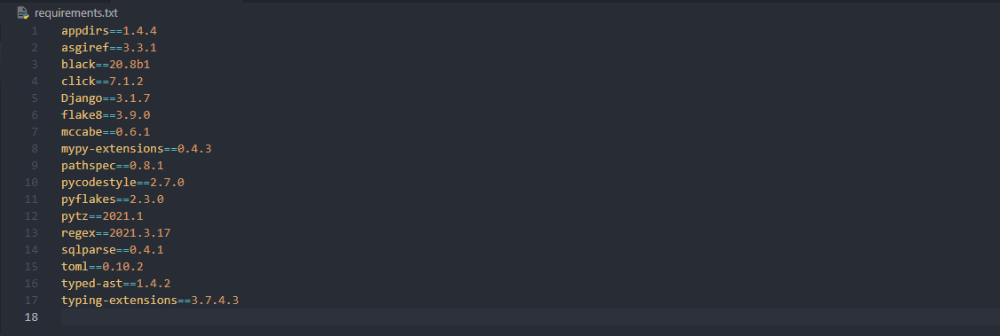

# Nomad coder - Airbnb Clone


#### 시작:

210321(일) in cafe DAMDA


#### 진행 상황

- [x] Modeling
  - [x] User App
  - [x] Room App
  - [x] Review App
  - [x] Conversation App
  - [x] Reservation App
  - [x] List App
- [ ] Admin
  - [ ] Customize admin page

- [ ] etc...


## 환경 설정


### 0) 원격 레포지토리 설정

github에서 원격 레포지토리 생성 후

```bash
$ git init
# README.md가 추가된 상태
$ git add .
$ git commit -m "init"
# 원격 레포지토리 연결
$ git remote add origin "https://github.com/byunghun-jake/nomad-airbnb.git"

# 원격 레포 연결 확인
$ git remote
origin

# push
$ git push -u origin
```

> push 시 -u 키워드의 의미: 기본 원격 레포지토리를 origin이라는 이름의 레포지토리로 설정한다는 뜻


### 1) 가상 환경 설정

```bash
# 가상 환경 설정하기
$ python -m venv venv

# 가상 환경 활성화
$ source venv/Scripts/activate
```

- 가상 환경 설정 시, `-m`을 쓰는 이유는 뭘까? [공식 문서](https://docs.python.org/ko/3/using/cmdline.html#cmdoption-m)

  > 제공한 모듈 이름을 sys.path에서 검색하고, 그 내용을 \__main__모듈로써 실행합니다.
  >
  > `python -m module-name`
  >
  > 즉, 파이썬 모듈을 실행하기 위해 입력하는 것!

- 노마드 코더는 pipenv라는 별도의 패키지를 사용하는데, venv를 쓰는 이유는?
  - [pipenv를 추천하지 않는 이유](https://velog.io/@doondoony/pipenv-101)
  - ssafy에서 배운 내용을 그대로 활용하고 싶어서
  - 파이썬을 맞춰서 새로 설치할 필요는 없을 것 같고, 컴퓨터에 설치된 파이썬을 그대로 사용하며 패키지만 관리해주려고


- 가상환경 설정 후 .gitignore 필요

  

  > 장고 패키지까지만 설치하였는데, 수많은 파일이 생성되어 있음

  

  > gitignore로 정리 완료 후
  >
  > 참고 사이트는 항상 애용하는 [gitignore](https://www.toptal.com/developers/gitignore)

  

### 2) django 패키지 설치

```bash
$ pip install django

# 패키지 설치 목록 저장
$ pip freeze > requirements.txt
```

> 패키지 목록을 따로 만드는 이유
>
> 우리는 venv를 원격 레포지토리에 올리지 않기 때문에, 어떤 패키지들이 이 프로젝트를 위해 설치되어 있는지 확인하기가 힘들다.
> pip freeze 명령어를 통해 특정한 파일에 지금까지 설치된 패키지를 저장함으로써 이 프로젝트를 보는 다른 사람들에게 패키지 정보를 전달할 수 있는 것이다.



> requirements.txt 예시


---


## 프로젝트 시작


### 1) 장고 프로젝트 생성하기

#### 프로젝트 생성

```bash
$ django-admin startproject config .
```

```
- config
- manage.py
- README.md
```

> config 폴더와 manage.py 파일이 생성됩니다.

> 명령어에서 마지막에 `.`을 붙인 이유: 현재 폴더에 config라는 이름의 장고 프로젝트를 생성하고 싶기 때문
>
> `.`을 붙이지 않는다면, 다음과 같은 폴더 구조가 생성됩니다.
>
> ```
> - config
> 	- config
> 	- manage.py
> - README.md
> ```


- Linter & Formatter

  - Linter는 실시간 **문법 검사기**라고 생각하면 될 것 같다.

    이 프로젝트에서는 `flake8`을 사용한다.

    설정 방법은 `ctrl + shift + p`를 눌러 vs 콘솔창을 켠 후, select linter를 선택하여 flake8을 선택하면 된다.

    그러고나면, flake8이 설치되어있지 않았다라는 메세지가 뜰 텐데 flake8 패키지를 설치해주면 된다.

    `$ pip install flake8` 

    한가지 추가로 설정해 줄 것이 있는데, E501 규칙에 대한 내용이다. (라인 당 글자 길이 제한)

    ```json
    // .vscode/settings.json
    
    {
        // ...
        "python.linting.flake8Args": ["--max-line-length=100"]
    }
    ```

    

  - Formatter는 **문법 교정기**라고 생각하면 될 것 같다.

    이 프로젝트에서는 `black`을 사용한다.

    vscode의 Format On Save 옵션을 활성화해주면, 파이썬 파일을 변경하고 저장할 때 마다 `black`이 확인하고 `formatting`을 수행한다.

  

  - config 폴더에 있는 `__init__.py`의 의미

    파이썬 파일이 담겨있는 하나의 폴더를 패키지처럼 (import 할 수 있는) 사용하기 위한 일종의 표시라고 생각하면 될 것 같다.

    "이 폴더는 패키지처럼 사용할꺼야"

  

#### 시간대, 언어 설정하기

```python
# settings.py

LANGUAGE_CODE = "ko-kr"

TIME_ZONE = "Asia/Seoul"
```


#### 기본 세팅 migrate

```bash
$ python manage.py migrate
```

> 장고 프로젝트를 생성하면, 기본적으로 DB를 위한 마이그레이션 파일이 생성됩니다.
>
> 마이그레이션 파일을 가지고 DB에 적용하는 작업을 migrate라고 하며, 이를 위와 같은 명령어로 수행할 수 있습니다.


#### admin 페이지 탐색하기

1. 관리자 계정 생성

   admin 페이지에 로그인할 관리자 계정을 생성해야 합니다.

   ```bash
   $ python manage.py createsuperuser
   ```

2. 서버 실행 후 admin 페이지 주소를 통해 접근하기

   ```bash
   $ python manage.py runserver
   ```

   

### 2) 앱 생성하기

> 장고 프로젝트는 앱(함수)의 집합입니다.
>
> 여러 앱으로 구성될 수 있으며, 기능에 따라 하나가 될 수도 있고 수십개가 될 수도 있습니다.
>
> **프로젝트를 본격적으로 시작하기 전에 만들고자 하는 서비스를 분석하며, 어떤 앱이 설치되어야 하는가에 대해 생각해봅시다.**


#### 앱 구조를 짜보자

- Rooms (숙소)

  - 숙소 생성(C)
  - 숙소 확인(R)
  - 숙소 수정(U)
  - 숙소 삭제(D)

  > 어라? CRUD??

- Reservations (예약)
- User (이용자)
  - CRUD
  - 로그인, 로그아웃
- Messages (메세지)
- Lists (이용자가 저장한 숙소 목록)

- Review (리뷰)


#### 앱 생성하기

1. 앱 생성하기

   ```bash
   $ python manage.py startapp rooms
   $ python manage.py startapp users
   $ python manage.py startapp reviews
   $ python manage.py startapp conversations
   $ python manage.py startapp lists
   $ python manage.py startapp reservations
   ```

   > 생성하는 앱 이름은 복수형이어야 합니다. (국룰)

   

2. 앱 등록하기

   > 생성한 앱은 프로젝트에 "이런 앱을 생성했습니다"라고 알려주어야 합니다.

   ```python
   # config/settings.py
   
   # Application definition
   
   PROJECT_APPS = [
       "users",
       "rooms",
       "reviews",
       "reservations",
       "lists",
   ]
   
   THIRD_PARTY_APPS = []
   
   DJANGO_APPS = [
       "django.contrib.admin",
       "django.contrib.auth",
       "django.contrib.contenttypes",
       "django.contrib.sessions",
       "django.contrib.messages",
       "django.contrib.staticfiles",
   ]
   
   INSTALLED_APPS = PROJECT_APPS + THIRD_PARTY_APPS + DJANGO_APPS
   ```

   > PROJECT_APPS에 `startapp` 명령어로 추가한 앱을 담아 INSTALLED_APPS에 포함시켰습니다.
   >
   > 이렇게 앱의 출생신고를 할 수 있습니다.

   

---


## USER APP

> **SSAFY와 차이점**
>
> ssafy에서는 user model을 관리하기 위한 app의 이름을 `accounts`로 명명하였음.


- 장고에서 USER 기능을 기본적으로 제공하고 있는데, 왜 따로 설치하는 걸까요?

  > 장고에서 기본적으로 제공하고 있는 것들로는 충분하지 않고, admin 페이지에 일반 이용자가 들어가서 여러 작업을 수행하는 것은 적합하지 않습니다.
  >
  > 따라서, 별도의 App을 생성하는 것입니다.


### User Model

> Model이란?
>
> DB가 어떻게 생겼는지 설명하는 것


#### 기존 User Model을 대체하기 위한 설정

[공식문서 - Substituting a custom User Model](https://docs.djangoproject.com/en/3.1/topics/auth/customizing/#substituting-a-custom-user-model)

1. 모델 디자인

   ```python
   # users/models.py
   from django.contrib.auth.models import AbstractUser
   
   class User(AbstractUser):
       pass
   ```

   

2. 변경한 모델 등록

   ```python
   # config/settings.py
   
   # default
   # AUTH_USER_MODEL= "auth.User"
   AUTH_USER_MODEL = "users.User"			# 앱이름.모델이름
   ```

   

3. 마이그레이션

   모델에 변경사항이 생겼다면, **항상** 해줘야 합니다!

   ```bash
   $ python manage.py makemigrations
   $ python manage.py migrate
   ```


#### User Model 수정

> User model을 새로 디자인해 봅시다.
> model은 Field로 구성되어 있습니다.

```python
# AbstractUser를 상속받음
from django.contrib.auth.models import AbstractUser
from django.db import models


class User(AbstractUser):
    """ Custom User Model """

    GENDER_MALE = "M"
    GENDER_FEMALE = "F"
    GENDER_OTHER = "ETC"

    GENDER_CHOICES = (
        (GENDER_MALE, "남성"),
        (GENDER_FEMALE, "여성"),
        (GENDER_OTHER, "기타"),
    )

    LANGUAGE_ENGLISH = "en"
    LANGUAGE_KOREAN = "ko"

    LANGUAGE_CHOICES = (
        (LANGUAGE_ENGLISH, "영어"),
        (LANGUAGE_KOREAN, "한국어"),
    )

    CURRENCY_USD = "usd"
    CURRENCY_KRW = "krw"
    CURRENCY_CHOICES = ((CURRENCY_USD, "USD"), (CURRENCY_KRW, "KRW"))

    avatar = models.ImageField(blank=True)
    gender = models.CharField(choices=GENDER_CHOICES, max_length=10, blank=True)
    bio = models.TextField(blank=True)
    birthdate = models.DateField(blank=True, null=True)
    language = models.CharField(choices=LANGUAGE_CHOICES, max_length=2, blank=True)
    currency = models.CharField(choices=CURRENCY_CHOICES, max_length=3, blank=True)
    is_superhost = models.BooleanField(default=False)
```


##### Field

1. **CharField**

   max_length는 반드시 입력해주어야 합니다.

   - choices

     **지정해 놓은 특정한 값만 허용하는 속성**

     [공식문서](https://docs.djangoproject.com/en/3.1/ref/models/fields/#choices)

2. ImageField

   **이미지 파일을 다루는 필드**

   사용하기 위해서는 Pillow라는 패키지를 프로젝트에 추가해주어야 합니다.

   ```bash
   $ pip install pillow
   $ pip freeze > requirements.txt
   ```

3. CharField

   > [공식문서](https://docs.djangoproject.com/en/3.1/ref/models/fields/#choices)

   - **choices** 속성

     선택지를 정해놓고, 정해놓은 값을 입력받도록 만든다.

     ```python
     GENDER_MALE = "M"
     GENDER_FEMALE = "F"
     GENDER_OTHER = "ETC"
     
     GENDER_CHOICES = (
         (GENDER_MALE, "남성"),
         (GENDER_FEMALE, "여성"),
         (GENDER_OTHER, "기타"),
     )
     
     gender = models.CharField(
         choices=GENDER_CHOICES, max_length=10, null=True, blank=True
     )
     ```

     > `GENDER_CHOICES`를 `choices`로 넣어주는데, 내부의 튜플의 의미는 다음과 같다.
     > `(실제 DB에 기록되는 값, User에게 보여지는 값)`
     >
     > The first element in each tuple is the actual value to be set on the model, and the second element is the human-readable name.

4. 공통 필드 속성

   - **default 속성**

     모델 변경 전에 생성한 User record가 있다면, model의 변경 사항으로 인해 bio 필드가 생길 것입니다.
     하지만, User 생성 시 bio가 입력되어있지 않기 때문에 필드 추가 시 기존 record에 어떤 값을 넣어주어야 할 지 알 수 없습니다.
     default 속성을 통해 필드를 추가할 때 기본값을 설정해 주는 것이죠.

   - **null 속성** [공식문서](https://docs.djangoproject.com/en/3.1/ref/models/fields/#null)

     수정 시 새로 추가하는 필드의 null 속성이 True라면, 이전에 생성된 record를 위해 별도의 작업을 해주지 않아도 됩니다.
     **하지만, 생성할 때 빈 값을 넣어도 된다는 의미는 아닙니다. (중요)**

     

   - **blank 속성** [공식문서](https://docs.djangoproject.com/en/3.1/ref/models/fields/#blank)

     **Form**을 통해 제출 시 값이 비어있어도 되는가에 대한 설정입니다.
     null과 혼동이 될 수도 있지만, **null은 DB / blank는 form** 에서 영향력을 발휘한다고 생각하면 이해하기 쉬울 것 같습니다.

   


모델을 수정하고, admin/user 페이지로 이동하면 Operation Error가 발생합니다.


`users/models.py`에는 bio 필드가 있지만, DB에는 bio 필드가 없습니다.
`users/admin.py`에 `users/models.py`를 import하여 페이지를 구성했기 때문에 admin 페이지와 DB가 동기화되지 않은 것이죠. (admin 페이지는 변경사항 적용 & DB는 미적용)
따라서, DB에 변경 사항을 적용해주어야 합니다. 바로, **migrate**로 말이죠.


### User Admin


#### 1. ModelAdmin 상속

> 기존 User model을 대체하였기 때문에 Admin 페이지에 새로 등록을 해주어야 합니다.

```python
# users/admin.py

from django.contrib import admin
from .models import User
# 생성한 모델을 admin에 등록하는 것이기에 불러와야 함


class UserAdmin(admin.ModelAdmin):
    list_display = (
        "id",
        "username",
        "email",
        "gender",
        "language",
        "currency",
        "is_superhost",
    )

    list_filter = (
        "is_superhost",
        "language",
        "currency",
    )


admin.site.register(User, UserAdmin)
```

> 1. UserAdmin: admin/model 페이지를 커스텀하기 위해 사용
>
>    list_display: 어떤 컬럼을 목록에 표시할 지 설정
>
> 2. admin.site.register: admin 페이지에 모델을 등록하는 코드
>
>    첫 번째 인자로는 모델을 받고, 두 번째 인자로는 커스텀을 위한 클래스를 받는다.


- User model을 사용하기 위해 불러오는 방식

  ssafy에서 배울 때에는 User를 커스텀한 후, 불러올 때는 직접 불러오지 않고 `get_user_model` 함수를 이용하라고 하였습니다.
  따라서, `from .models import User` 대신 `from django.contrib.auth import get_user_model`을 사용합니다.

  ```python
  from django.contrib import admin
  from django.contrib.auth import get_user_model
  
  class UserAdmin():
      #...
  
  admin.site.register(get_user_model(), UserAdmin)
  ```

  

- Admin page에 model을 등록하는 방법

  1. 메서드

     ```python
     from django.contrib import admin
     from django.contrib.auth import get_user_model
     
     class UserAdmin(admin.ModelAdmin):
        #...
     
     admin.site.register(get_user_model(), UserAdmin)
     ```

     

  2. 데코레이터

     ```python
     from django.contrib import admin
     from django.contrib.auth import get_user_model
     
     @admin.register(get_user_model())
     class UserAdmin(admin.ModelAdmin):
        #...
     ```

     

#### 2. UserAdmin 상속

> django는 User model을 위한 admin 클래스가 이미 존재한다.
> `UserAdmin`

> 이 클래스를 상속 받아 CustomUserAdmin을 정의해보자


admin 상세페이지에서 각 필드를 그룹화하기 위해 `fieldset` 클래스 변수를 사용합니다.

```python
from django.contrib import admin
from django.contrib.auth.admin import UserAdmin
from django.contrib.auth import get_user_model

class CustomUserAdmin(UserAdmin):
    """ Custom User Admin """

    fieldsets = UserAdmin.fieldsets + (
        (
            "CustomProfile",
            {
                "fields": (
                    "avatar",
                    "gender",
                    "bio",
                    "birthdate",
                    "language",
                    "currency",
                    "is_superhost",
                ),
            },
        ),
    )
    
admin.site.register(get_user_model(), CustomUserAdmin)
```

> 기존에 정의되어 있던 fieldsets를 사용하기 위해, `UserAdmin.fieldsets`를 "+"로 붙여주었다.


---


## 모델링


### 앱 세팅

- INSTALLED_APPS에 추가하기

  > 앱을 등록하는 방식도 여러가지가 있었는지 몰랐음

  - Nico's way

    ```python
    PROJECT_APPS = [
        "users.apps.UsersConfig",
        "rooms.apps.RoomsConfig",
    ]
    ```

  - My way

    ```python
    PROJECT_APPS = [
        "users",
        "rooms",
    ]
    ```

---

### Room App

#### Model

- created_at과 updated_at이 사용되는 모델이 다양하기 때문에 **모델 상속**을 공부하는 겸 Timestamp model을 만들어보도록 하자!
  추가로 **추상 모델**에 대한 공부도 할 수 있다.

  상속을 위한 model은 core라는 별도의 앱에 작성할 예정이므로, 

  1. core app 생성

  2. core app 등록

  3. core/models.py에 TimeStampedModel 정의

     ```python
     from django.db import models
     
     
     class TimeStampedModel(models.Model):
     
         """ Time Stamped Model(created_at & updated_at) """
     
         # auto_now_add: 생성 시간을 입력
         created_at = models.DateTimeField(auto_now_add=True)
         # auto_now: save 메서드 호출 시 시간을 입력
         updated_at = models.DateTimeField(auto_now=True)
     
         class Meta:
             abstract = True
     ```

     - abstract

       If `abstract = True`, this model will be an [abstract base class](https://docs.djangoproject.com/en/3.1/topics/db/models/#abstract-base-classes).

       추상화 모델 클래스는 데이터 베이스에 영향을 주지 않는, 다른 모델 클래스를 위한 클래스입니다.

- 생각해보니 core app에서 작성한 모델을 rooms나 다른 모델에서 사용하려면, INSTALLED_APPS에서의 순서가 꼭 지켜져야 할 것 같다. 아니면, settings.py에 위치에 대한 정보를 문자열로 저장해둠으로써 가능할까?

  > User model을 사용할 때는 문제가 발생했지만, TimeStampedModel은 상속에 대한 내용이라, 문제가 없었나? 싶다.

  

  > 교수님께 질문해야지

  

- Room 모델링

  ```python
  from django.db import models
  from django.contrib.auth import get_user_model
  from django_countries.fields import CountryField
  from core.models import TimeStampedModel
  
  
  class Room(TimeStampedModel):
  
      """ Room Model definition """
  
      name = models.CharField(max_length=140)
      # 1(User):N(Room)
      host = models.ForeignKey(get_user_model(), on_delete=models.CASCADE)
      description = models.TextField()
      # 국가 정보를 위해 서드파티 라이브러리 설치
      country = CountryField()
      city = models.CharField(max_length=140)
      price = models.IntegerField()
      address = models.CharField(max_length=140)
      max_guests = models.IntegerField()
      beds = models.IntegerField()
      bedrooms = models.IntegerField()
      baths = models.IntegerField()
      check_in = models.TimeField()
      check_out = models.TimeField()
      instant_book = models.BooleanField(default=False)
  ```

  

  - User는 여러 Room을 생성할 수 있고, Room은 하나의 User를 host로 갖는다.
    이를 1:N 관계라고 하며, model을 정의할 때 ForeignKey라는 이름의 필드를 사용한다.

    - ForeignKey

      필수 위치 인자(target model)를 받고, 필수 이름 인자(on_delete)를 받는다.

      1:N 관계 중 N에 해당하는 model에 작성한다.

      `on_delete=models.CASCAD`란, 참조하는 target이 삭제되었을 때 target을 참조하고 있던 source가 삭제됨을 의미한다.

      

    

  - 국가 관련 정보를 담기 위해 서드파티 라이브러리를 사용하였다.

    

  - 생성 시간과 수정 시간이 필요하기 때문에 TimeStampedModel을 상속받았다.


- Room에 사용할 M:N 관계를 위한 모델 생성

  ```python
  class AbstractItem(TimeStampedModel):
      """ AbstractItem """
  
      name = models.CharField(max_length=80)
      description = models.TextField(blank=True)
  
      class Meta:
          abstract = True
  
      def __str__(self):
          return self.name
  
  
  class RoomType(AbstractItem):
  
      """ RoomType Model Definition """
  
      class Meta:
          verbose_name = "Room Type"
  
  
  class Amenity(AbstractItem):
  
      """ Amenity Model Definition """
  
      class Meta:
          verbose_name_plural = "Amenities"
  
  
  class Facility(AbstractItem):
  
      """ Facility Model Definition """
  
      class Meta:
          verbose_name_plural = "Facilities"
  
  
  class HouseRule(AbstractItem):
  
      """ HouseRule Model Definition """
  
      class Meta:
          verbose_name = "House Rule"
      
      
  class Room(TimeStampedModel):
      # ...
      room_type = models.ManyToManyField(RoomType)
  ```

  

  - RoomType, Amenity 등을 위한 AbstractItem 클래스를 생성

    

  - Room과 RoomType은 1:N 관계

  - Amenity, Facility, House Rule은 Room과 M:N 관계

    M:N 관계를 나타내는 것은 **ManyToManyField**이다.

    - ManyToManyField

      한 개의 필수 위치 인자(target model)를 받는다.

      

  - [get_model](https://docs.djangoproject.com/en/3.1/ref/applications/#django.apps.AppConfig.get_model)

    

  - Photo 모델을 따로 만든 것이 특이하다고 생각 (왜 방과 구별했을까? 구별 해야만 하는 것은 아닌 것 같은데?)

    > 한 방에 여러 사진을 올려야 하니까 따로 모델을 만들어 준 것 같다

    

  - RoomType, Amenity, Facility, HouseRule은 select field로 만들어도 되지만, 별개의 모델로 만들었기 때문에 개발자가 하드 코딩으로 넣는 것이 아닌 외부에서 변경이 가능해진다.


#### Admin

```python
from django.contrib import admin
from .models import Room, RoomType, Amenity, Facility, HouseRule, Photo


class ItemAdmin(admin.ModelAdmin):

    """ Item Admin Definition """

    pass


class RoomAdmin(admin.ModelAdmin):

    """ Item Admin Definition """

    pass


class PhotoAdmin(admin.ModelAdmin):

    """ Photo Admin Definition """

    pass


admin.site.register(Room, RoomAdmin)
admin.site.register(RoomType, ItemAdmin)
admin.site.register(Amenity, ItemAdmin)
admin.site.register(Facility, ItemAdmin)
admin.site.register(HouseRule, ItemAdmin)
admin.site.register(Photo, PhotoAdmin)
```


- AbstractItem 클래스를 부모로 갖는 RoomType, Amenity, Facility, HouseRule은 공통 Admin 클래스(`ItemAdmin`)로 등록한다.


---

### Review App

- 리뷰에 필요한 항목을 확인해보자
  1. 작성자
  2. 숙소
  3. 내용 (글)
  4. 시간
  5. 항목 별 평점


#### Model


- 다른 모델 클래스를 사용해야 하는 경우에는 쌍따옴표로 감싸 텍스트로 입력해 줄 수도 있다.

  ```python
  from rooms.model import Room
  
  class Review:
      room = models.ForeignKey(Room, on_delete=models.CASCADE)
      room = models.ForeignKey("rooms.Room", on_delete=models.CASCADE)
  ```

  > 두 방식 모두 동일하다.
  >
  > 단, import를 이용한 방식은 INSTALLED_APPS의 순서에 영향을 받는다.


```python
# reviews/models.py

from django.db import models
from django.conf import settings
from core.models import TimeStampedModel


class Review(TimeStampedModel):

    """ Review Model Definition """

    user = models.ForeignKey(settings.AUTH_USER_MODEL, on_delete=models.CASCADE)
    room = models.ForeignKey("rooms.Room", on_delete=models.CASCADE)
    content = models.TextField()
    # score
    accuracy = models.IntegerField()
    communication = models.IntegerField()
    cleanliness = models.IntegerField()
    location = models.IntegerField()
    check_in = models.IntegerField()
    value = models.IntegerField()
    
    def __str__(self):
        return f"{self.content} - {self.room.name}"
```

- `__str__` 메서드를 이용하여, 해당 모델의 레코드 기본 출력값을 설정


#### Admin

```python
# reviews/admin.py

from django.contrib import admin
from .models import Review


class ReviewAdmin(admin.ModelAdmin):

    """ Review Admin Definition """

    pass


admin.site.register(Review, ReviewAdmin)
```


---

### Reservation App

#### Model

**예약과정**

> 네이버와 동일하게 구성이 되어있는 듯 하다.

- 네이버는 예약 과정을 어떻게 구분하고 있을까?
  - 예약 진행 중
  - 예약 확정
  - 예약 취소

- 강의에서 예약을 구분하는 방식
  - pending
  - confirmed
  - canceled


```python
# reservations/models.py

from django.db import models
from django.contrib.auth import get_user_model
from core.models import TimeStampedModel


class Reservation(TimeStampedModel):

    """ Reservation Model Definition """

    STATUS_PENDING = "pending"
    STATUS_CONFIRMED = "confirmed"
    STATUS_CANCELED = "canceled"

    STATUS_CHOICES = (
        (STATUS_PENDING, "예약 진행 중"),
        (STATUS_CONFIRMED, "예약 확정"),
        (STATUS_CANCELED, "예약 취소"),
    )

    # 사람은 여러 예약을 만들 수 있지
    guest = models.ForeignKey(get_user_model(), on_delete=models.CASCADE)
    # 한 방을 기준으로 여러 예약이 생성될 수 있어
    room = models.ForeignKey("rooms.Room", on_delete=models.CASCADE)
    status = models.CharField(
        max_length=20, choices=STATUS_CHOICES, default=STATUS_PENDING
    )
    # 예약 날짜
    check_in = models.DateField()
    check_out = models.DateField()

    def __str__(self):
        return f"{self.room} - {self.check_in} ~ {self.check_out}"
```


- guest가 reservation과 1:1 관계가 아닌가 헷갈렸었다.

  하나의 예약 레코드를 기준으로 보면 guest와 reservation 간의 관계는 1:1이 되지만, 여기서 작성하는 모델은 레코드를 만드는 설계도에 대한 내용임을 잊지 말아야겠다.

  Reservation 이라는 예약 레코드들의 모음에서 바라보면, 한 user(guest)는 여러 예약 record를 생성할 수 있다. 하지만, 한 reservation은 여러 guest를 담는 것이 아니다.

  따라서, guest와 reservation 간의 관계는 1:N이 되는 것


#### Admin

```python
# reservations/admin.py

from django.contrib import admin
from .models import Reservation


class ReservationAdmin(admin.ModelAdmin):

    """ Reservation Admin Definition """

    pass


admin.site.register(Reservation, ReservationAdmin)
```


---

### List App

> 숙소 스크랩 기능을 관리하는 앱

#### Model

```python
# lists/models.py

from django.db import models
from django.contrib.auth import get_user_model
from core.models import TimeStampedModel


class List(TimeStampedModel):

    """ List Model Definition """

    user = models.ForeignKey(get_user_model(), on_delete=models.CASCADE)
    rooms = models.ManyToManyField("rooms.Room", blank=True)
    name = models.CharField(max_length=80)

    def __str__(self):
        return f"{self.name} by. {self.user.username}"
```


#### Admin

```python
# lists/admin.py

from django.contrib import admin
from .models import List


class ListAdmin(admin.ModelAdmin):

    """ List Admin Definition """

    pass


admin.site.register(List, ListAdmin)
```


---

### Conversation App

#### Model

```python
# conversations/models.py

from django.db import models
from django.contrib.auth import get_user_model
from core.models import TimeStampedModel


class Conversation(TimeStampedModel):

    """ Conversation Model Definition """

    # 대화에 참여하는 사람은 여러명(3명 이상)이 될 수 있다.
    participants = models.ManyToManyField(get_user_model(), blank=True)

    def __str__(self):
        return self.created_at


# 대화에서 사용되는 메세지를 만드는 클래스
class Message(TimeStampedModel):

    """ Message Model Definition """

    user = models.ForeignKey(get_user_model(), on_delete=models.CASCADE)
    content = models.CharField(max_length=100)
    conversation = models.ForeignKey("Conversation", on_delete=models.CASCADE)

    def __str__(self):
        return f"{self.user}: {self.content}"
```


- **대화 클래스와 메세지 클래스를 따로 만드는 것이 신기하다.**

  꼼꼼히 생각해보지 않았다면, 대화 클래스에 메세지를 함께 넣어버리는 상황이 될 수 있겠어요.

  

- Conversation = 대화방 / Message = 메세지

  

- 대화방에 참여하는 사람이 3명 이상이 될 수 있기 때문에, ManyToManyField를 사용


#### Admin

```python
# conversations/admin.py

from django.contrib import admin
from .models import Conversation, Message


class ConversationAdmin(admin.ModelAdmin):

    """ Conversation Admin Definition """

    pass


class MessageAdmin(admin.ModelAdmin):

    """ Message Admin Definition """

    pass


admin.site.register(Conversation, ConversationAdmin)
admin.site.register(Message, MessageAdmin)
```


## # 6 ROOM ADMIN


```python
class RoomAdmin(admin.ModelAdmin):

    """ Item Admin Definition """

    list_display = (
        "name",
        "country",
        "city",
        "price",
        "max_guests",
        "beds",
        "bedrooms",
        "baths",
        "check_in",
        "check_out",
        "instant_book",
    )

    list_filter = (
        "instant_book",
        "city",
        "country",
    )

    search_fields = [
        "city",
        "name",
        "host__username",
    ]
```

- vs code 단축키

  - 블록 지정한 것들을 줄 단위로 쪼개는 단축키

    `alt + shift + i`


- `list_display` [공식문서](https://docs.djangoproject.com/en/3.1/ref/contrib/admin/#django.contrib.admin.ModelAdmin.list_display)

  목록에서 어떤 필드를 보여줄 것인지 (어떤 column을 추가할 것인지)

  `ManyToManyField`로 정의된 필드를 추가하기 위해서는 추가 작업이 필요하다.

  ```python
  # amenities 필드에서 선택된 개수를 보여주고 싶다면?
  
  class RoomAdmin(admin.modelAdmin):
      
      list_display = (
      	# ...
          count_amenities,
      )
      
      # ...
  
      def count_amenities(self, obj):
          return obj.amenities.count()
  ```

  

- `list_filter` [공식문서](https://docs.djangoproject.com/en/3.1/ref/contrib/admin/#django.contrib.admin.ModelAdmin.list_filter)

  어떤 필드를 기준으로 필터링을 할 것인지

  

- `search_fields` [공식문서](https://docs.djangoproject.com/en/3.1/ref/contrib/admin/#django.contrib.admin.ModelAdmin.search_fields)

  > Set `search_fields` to enable a search box on the admin change list page. This should be set to a list of field names that will be searched whenever somebody submits a search query in that text box.

  **검색 방식**

  - `^`: startswith
  - `=`: iexact
  - `@`: search
  - `Deafult`: icontains

  

  **외래키 검색도 가능**

  

- `filter_horizontal`

  > By default, a [`ManyToManyField`](https://docs.djangoproject.com/en/3.1/ref/models/fields/#django.db.models.ManyToManyField) is displayed in the admin site with a `<select multiple>`. However, multiple-select boxes can be difficult to use when selecting many items. Adding a [`ManyToManyField`](https://docs.djangoproject.com/en/3.1/ref/models/fields/#django.db.models.ManyToManyField) to this list will instead use a nifty unobtrusive JavaScript “filter” interface that allows searching within the options. The unselected and selected options appear in two boxes side by side. See [`filter_vertical`](https://docs.djangoproject.com/en/3.1/ref/contrib/admin/#django.contrib.admin.ModelAdmin.filter_vertical) to use a vertical interface.
  
  
  
- Ordering

  > Set `ordering` to specify how lists of objects should be ordered in the Django admin views. This should be a list or tuple in the same format as a model’s [`ordering`](https://docs.djangoproject.com/en/3.1/ref/models/options/#django.db.models.Options.ordering) parameter.
  >
  > If this isn’t provided, the Django admin will use the model’s default ordering.
  >
  > If you need to specify a dynamic order (for example depending on user or language) you can implement a [`get_ordering()`](https://docs.djangoproject.com/en/3.1/ref/contrib/admin/#django.contrib.admin.ModelAdmin.get_ordering) method.

  


